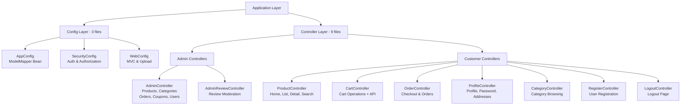
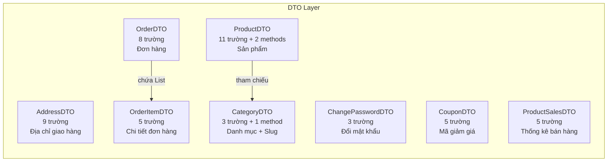
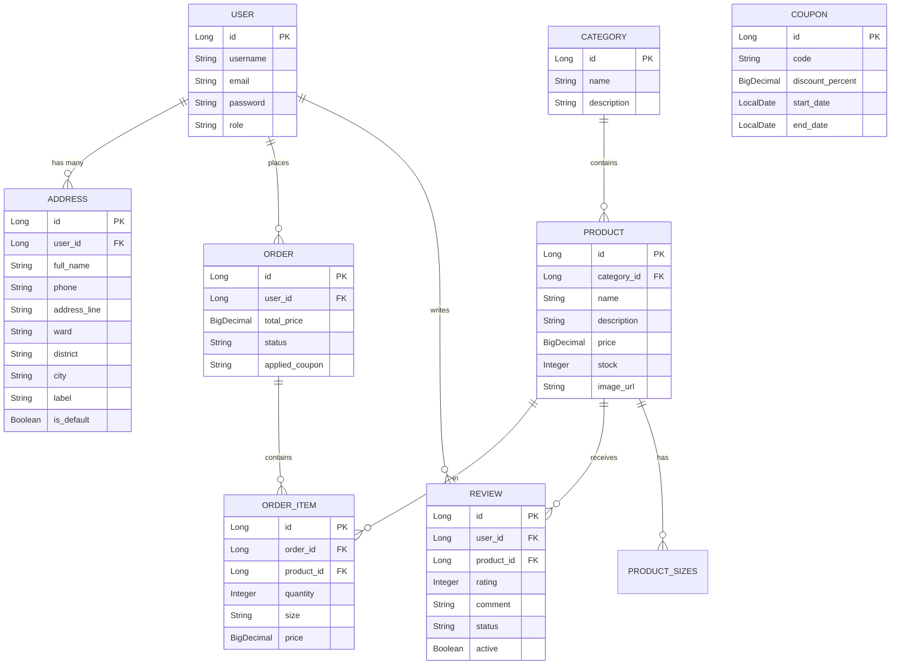
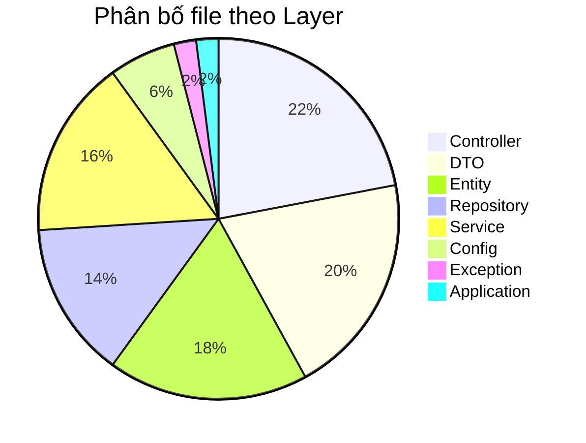
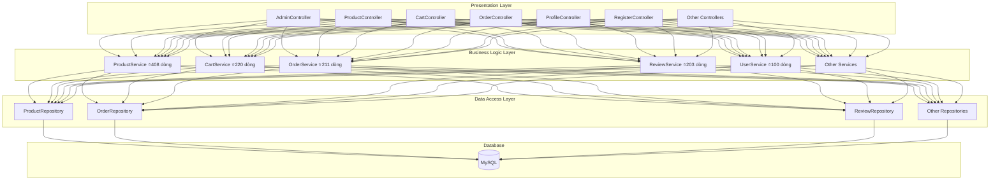

# 📋 Phân Tích Chi Tiết Code Java — Kids Fashion Store (Phần 1: 13/52 file)

> [!NOTE]
> Đây là phần phân tích 13 file Java đầu tiên, bao gồm: **Application**, **Config** và **Controller** layers.

---

## 📁 Tổng quan cấu trúc đã phân tích

| # | Package | File | Dòng code | Mô tả ngắn |
|---|---------|------|-----------|-------------|
| 1 | `root` | `KidsFashionApplication.java` | 15 | Điểm khởi chạy ứng dụng |
| 2 | `config` | `AppConfig.java` | 14 | Cấu hình ModelMapper bean |
| 3 | `config` | `SecurityConfig.java` | 97 | Cấu hình Spring Security |
| 4 | `config` | `WebConfig.java` | 34 | Cấu hình MVC & upload path |
| 5 | `controller` | `AdminController.java` | 354 | Quản trị tổng hợp (CRUD) |
| 6 | `controller` | `AdminReviewController.java` | 73 | Quản trị đánh giá sản phẩm |
| 7 | `controller` | `CartController.java` | 300 | Giỏ hàng (REST + View) |
| 8 | `controller` | `CategoryController.java` | 40 | Danh mục phía khách hàng |
| 9 | `controller` | `LogoutController.java` | 13 | Đăng xuất |
| 10 | `controller` | `OrderController.java` | 77 | Đơn hàng phía khách hàng |
| 11 | `controller` | `ProductController.java` | 150 | Sản phẩm phía khách hàng |
| 12 | `controller` | `ProfileController.java` | 188 | Hồ sơ cá nhân |
| 13 | `controller` | `RegisterController.java` | 53 | Đăng ký tài khoản |

---

## 1. `KidsFashionApplication.java`

**📍 Đường dẫn:** `com.example.kidsfashion`
**🎯 Mục đích:** Điểm khởi chạy (entry point) của toàn bộ ứng dụng Spring Boot.

### Annotation sử dụng
- `@SpringBootApplication` — Kết hợp 3 annotation: `@Configuration`, `@EnableAutoConfiguration`, `@ComponentScan`.

### Phương thức

| Phương thức | Mô tả |
|-------------|-------|
| `main(String[] args)` | Khởi động ứng dụng Spring Boot bằng `SpringApplication.run()`. Đây là phương thức static tiêu chuẩn của mọi ứng dụng Spring Boot. |

---

## 2. `AppConfig.java`

**📍 Đường dẫn:** `com.example.kidsfashion.config`
**🎯 Mục đích:** Cấu hình các bean dùng chung trong toàn ứng dụng.

### Annotation sử dụng
- `@Configuration` — Đánh dấu class là nguồn cấu hình Spring.

### Phương thức

| Phương thức | Kiểu trả về | Mô tả |
|-------------|-------------|-------|
| `modelMapper()` | `ModelMapper` | Tạo bean `ModelMapper` — thư viện dùng để chuyển đổi (mapping) tự động giữa **Entity** và **DTO**. Ví dụ: `Product` → `ProductDTO`. Được đánh dấu `@Bean` để Spring container quản lý. |

---

## 3. `SecurityConfig.java`

**📍 Đường dẫn:** `com.example.kidsfashion.config`
**🎯 Mục đích:** Cấu hình toàn bộ hệ thống bảo mật (authentication & authorization) của ứng dụng bằng Spring Security.

### Annotation sử dụng
- `@Configuration` + `@EnableWebSecurity` — Kích hoạt cấu hình bảo mật web tùy chỉnh.

### Phương thức

| Phương thức | Kiểu trả về | Mô tả |
|-------------|-------------|-------|
| `passwordEncoder()` | `PasswordEncoder` | Tạo bean `BCryptPasswordEncoder` — thuật toán mã hóa mật khẩu một chiều. Mọi mật khẩu lưu trong DB đều được mã hóa BCrypt. |
| `filterChain(HttpSecurity http)` | `SecurityFilterChain` | **Cấu hình bảo mật chính** của ứng dụng, bao gồm: |

#### Chi tiết `filterChain()`:

```
┌─────────────────────────────────────────────────────────────┐
│                    CSRF Configuration                        │
│  Tắt CSRF cho các endpoint giỏ hàng (AJAX calls):          │
│  /cart/add, /cart/update, /cart/remove,                      │
│  /cart/apply-coupon, /cart/remove-coupon                     │
├─────────────────────────────────────────────────────────────┤
│                 Authorization Rules                          │
│  ✅ permitAll: /, /products/**, /css/**, /register,...       │
│  ✅ permitAll: /cart/add, /cart/api/**, /cart/summary        │
│  🔒 authenticated: /cart, /checkout/**                      │
│  🔒 ROLE_ADMIN: /admin/**, /admin/reviews/**                │
│  🔒 authenticated: tất cả request còn lại                   │
├─────────────────────────────────────────────────────────────┤
│                  Form Login                                  │
│  Trang login: /?login (modal trên trang chủ)                │
│  URL xử lý: /login                                          │
│  Thành công → redirect về /                                  │
│  Thất bại → customAuthenticationFailureHandler              │
├─────────────────────────────────────────────────────────────┤
│                    Logout                                    │
│  URL logout: /logout                                         │
│  Thành công → /logout-success                                │
│  Xóa session, cookies JSESSIONID, clearAuthentication       │
└─────────────────────────────────────────────────────────────┘
```

| Phương thức | Kiểu trả về | Mô tả |
|-------------|-------------|-------|
| `customAuthenticationFailureHandler()` | `AuthenticationFailureHandler` | Xử lý khi đăng nhập thất bại. **Nếu AJAX request** (header `X-Requested-With: XMLHttpRequest`): trả về JSON `{"success":false, "message":"..."}` với status 401. **Nếu request thường**: redirect về `/?error=true`. |

---

## 4. `WebConfig.java`

**📍 Đường dẫn:** `com.example.kidsfashion.config`
**🎯 Mục đích:** Cấu hình Spring MVC — đăng ký view controllers và resource handlers cho file upload.

### Annotation sử dụng
- `@Configuration` — class cấu hình.
- `@Value("${upload.path}")` — inject giá trị từ `application.properties`.

### Phương thức

| Phương thức | Mô tả |
|-------------|-------|
| `addViewControllers(ViewControllerRegistry)` | Đăng ký 2 view controller đơn giản: `/login` → `login.html`, `/logout` → `logout.html`. Không cần tạo Controller class riêng cho 2 trang này. |
| `addResourceHandlers(ResourceHandlerRegistry)` | Cấu hình phục vụ file tĩnh từ thư mục upload. URL `/uploads/**` sẽ trỏ đến thư mục vật lý `${upload.path}` trên server. Cache 3600 giây (1 giờ). Có in debug log để kiểm tra đường dẫn. |

---

## 5. `AdminController.java` ⭐

**📍 Đường dẫn:** `com.example.kidsfashion.controller`
**🎯 Mục đích:** Controller quản trị tổng hợp — quản lý CRUD cho **Products, Categories, Orders, Coupons, Users** từ trang Admin.

### Annotation sử dụng
- `@Controller` + `@RequestMapping("/admin")` — Tất cả endpoint bắt đầu bằng `/admin`.
- `@RequiredArgsConstructor` (Lombok) — Tự động inject dependencies qua constructor.

### Dependencies (7 services)
`ProductService`, `CategoryService`, `OrderService`, `CouponService`, `UserService`, `ReviewService`, `PasswordEncoder`

### Phương thức

#### 📊 Dashboard
| Phương thức | HTTP | URL | Mô tả |
|-------------|------|-----|-------|
| `dashboard(Model)` | GET | `/admin/dashboard` | Hiển thị trang tổng quan admin: tổng sản phẩm, tổng đơn hàng, tổng doanh thu, top 5 sản phẩm bán chạy, 5 đơn hàng mới nhất, dữ liệu biểu đồ doanh thu/đơn hàng theo tháng, thống kê review. |

#### 🛍️ Product Management (CRUD)
| Phương thức | HTTP | URL | Mô tả |
|-------------|------|-----|-------|
| `listProducts(int page, int size, Model)` | GET | `/admin/products` | Liệt kê sản phẩm có **phân trang** (page, size). |
| `newProductForm(Model)` | GET | `/admin/products/new` | Hiển thị form tạo sản phẩm mới, kèm danh sách danh mục. |
| `saveProduct(ProductDTO, MultipartFile, RedirectAttributes)` | POST | `/admin/products/save` | Lưu sản phẩm (tạo mới hoặc cập nhật). Kiểm tra file upload phải là ảnh. Phân biệt tạo mới (id == null) và cập nhật (id != null). |
| `editProductForm(Long id, Model)` | GET | `/admin/products/edit/{id}` | Hiển thị form chỉnh sửa sản phẩm theo ID. |
| `deleteProduct(Long id, RedirectAttributes)` | GET | `/admin/products/delete/{id}` | Xóa sản phẩm theo ID. |

#### 📂 Category Management (CRUD)
| Phương thức | HTTP | URL | Mô tả |
|-------------|------|-----|-------|
| `listCategories(Model)` | GET | `/admin/categories` | Liệt kê tất cả danh mục. |
| `newCategoryForm(Model)` | GET | `/admin/categories/new` | Hiển thị form tạo danh mục mới. |
| `saveCategory(CategoryDTO, RedirectAttributes)` | POST | `/admin/categories/save` | Lưu danh mục (tạo mới hoặc cập nhật). |
| `editCategoryForm(Long id, Model)` | GET | `/admin/categories/edit/{id}` | Hiển thị form chỉnh sửa danh mục. |
| `deleteCategory(Long id, RedirectAttributes)` | GET | `/admin/categories/delete/{id}` | Xóa danh mục theo ID. |

#### 📦 Order Management
| Phương thức | HTTP | URL | Mô tả |
|-------------|------|-----|-------|
| `listOrders(int page, int size, Model)` | GET | `/admin/orders` | Liệt kê đơn hàng có **phân trang**. |
| `viewOrder(Long id, Model)` | GET | `/admin/orders/{id}` | Xem chi tiết 1 đơn hàng. |
| `updateOrderStatus(Long orderId, String status, RedirectAttributes)` | POST | `/admin/orders/update-status` | Cập nhật trạng thái đơn hàng (VD: PENDING → SHIPPED → DELIVERED). |

#### 🎟️ Coupon Management (CRUD)
| Phương thức | HTTP | URL | Mô tả |
|-------------|------|-----|-------|
| `listCoupons(Model)` | GET | `/admin/coupons` | Liệt kê tất cả mã giảm giá. |
| `newCouponForm(Model)` | GET | `/admin/coupons/new` | Hiển thị form tạo mã giảm giá mới. |
| `saveCoupon(CouponDTO, RedirectAttributes)` | POST | `/admin/coupons/save` | Lưu mã giảm giá (tạo mới hoặc cập nhật). |
| `editCouponForm(Long id, Model)` | GET | `/admin/coupons/edit/{id}` | Hiển thị form chỉnh sửa mã giảm giá. |
| `deleteCoupon(Long id, RedirectAttributes)` | GET | `/admin/coupons/delete/{id}` | Xóa mã giảm giá. |

#### 👤 User Management (CRUD)
| Phương thức | HTTP | URL | Mô tả |
|-------------|------|-----|-------|
| `listUsers(Model)` | GET | `/admin/users` | Liệt kê tất cả người dùng. |
| `newUserForm(Model)` | GET | `/admin/users/new` | Hiển thị form tạo user mới. |
| `saveUser(User, Boolean changePassword, RedirectAttributes)` | POST | `/admin/users/save` | Lưu user — logic phức tạp: **Tạo mới**: yêu cầu password, mã hóa BCrypt, gán role mặc định `ROLE_CUSTOMER`. **Cập nhật**: chỉ thay đổi password nếu checkbox `changePassword` được check, mã hóa password mới bằng `PasswordEncoder`. |
| `editUserForm(Long id, Model)` | GET | `/admin/users/edit/{id}` | Hiển thị form chỉnh sửa user. |
| `deleteUser(Long id, RedirectAttributes)` | GET | `/admin/users/delete/{id}` | Xóa user theo ID. |

---

## 6. `AdminReviewController.java`

**📍 Đường dẫn:** `com.example.kidsfashion.controller`
**🎯 Mục đích:** Controller quản trị đánh giá sản phẩm (review moderation) — cho phép Admin duyệt, từ chối hoặc xóa review.

### Annotation sử dụng
- `@Controller` + `@RequestMapping("/admin/reviews")`
- `@RequiredArgsConstructor`

### Phương thức

| Phương thức | HTTP | URL | Mô tả |
|-------------|------|-----|-------|
| `listReviews(ReviewStatus status, Model)` | GET | `/admin/reviews` | Liệt kê reviews. Nếu có query param `status` (PENDING/APPROVED/REJECTED) thì lọc theo trạng thái, không thì hiển thị tất cả. |
| `viewReview(Long id, Model)` | GET | `/admin/reviews/{id}` | Xem chi tiết 1 review. |
| `approveReview(Long id, RedirectAttributes)` | POST | `/admin/reviews/{id}/approve` | **Duyệt** review — set trạng thái thành `APPROVED`. |
| `rejectReview(Long id, RedirectAttributes)` | POST | `/admin/reviews/{id}/reject` | **Từ chối** review — set trạng thái thành `REJECTED`. |
| `deleteReview(Long id, RedirectAttributes)` | POST | `/admin/reviews/{id}/delete` | **Xóa** review khỏi database. |

---

## 7. `CartController.java` ⭐

**📍 Đường dẫn:** `com.example.kidsfashion.controller`
**🎯 Mục đích:** Controller giỏ hàng — kết hợp cả **view rendering** (Thymeleaf) và **REST API** (JSON response) cho các thao tác AJAX.

### Annotation sử dụng
- `@Controller` + `@RequestMapping("/cart")`
- `@RequiredArgsConstructor`

### Đặc điểm kiến trúc
- Sử dụng `HttpSession` để lưu trữ giỏ hàng (session-based cart, không lưu DB).
- Các endpoint thêm/sửa/xóa đều trả về `ResponseEntity<Map>` (JSON) → phục vụ AJAX calls.
- Có logging chi tiết (`SLF4J Logger`) cho việc debug.

### Phương thức

| Phương thức | HTTP | URL | Response | Mô tả |
|-------------|------|-----|----------|-------|
| `viewCart(HttpSession, Model)` | GET | `/cart` | HTML | Hiển thị trang giỏ hàng đầy đủ: danh sách items, tổng tiền gốc, tổng sau giảm giá, tiền tiết kiệm, mã coupon đang áp dụng, danh sách coupon active. |
| `getCartSize(HttpSession)` | GET | `/cart/api/cart/size` | JSON | API trả về số lượng item trong giỏ (dùng để cập nhật badge trên icon giỏ hàng). |
| `addToCart(Long productId, int quantity, String size, HttpSession)` | POST | `/cart/add` | JSON | Thêm sản phẩm vào giỏ hàng. Validate quantity > 0. Nhận thêm tham số `size` (kích cỡ). Trả về `cartSize`, `total`, `message`. |
| `updateCart(Long productId, int quantity, HttpSession)` | POST | `/cart/update` | JSON | Cập nhật số lượng sản phẩm trong giỏ. Validate quantity > 0. |
| `removeFromCart(Long productId, HttpSession)` | POST | `/cart/remove` | JSON | Xóa sản phẩm khỏi giỏ. Trả về thêm `cartEmpty` flag. |
| `applyCoupon(String couponCode, HttpSession)` | POST | `/cart/apply-coupon` | JSON | Áp dụng mã giảm giá. Kiểm tra giỏ không rỗng. Trả về `originalTotal`, `discountedTotal`, `savedAmount`. |
| `removeCoupon(HttpSession)` | POST | `/cart/remove-coupon` | JSON | Gỡ mã giảm giá đang áp dụng. Trả về tổng tiền gốc (không giảm). |
| `getCartSummary(HttpSession)` | GET | `/cart/summary` | JSON | API tổng hợp toàn bộ thông tin giỏ hàng: size, total, originalTotal, savedAmount, appliedCoupon, items. |

---

## 8. `CategoryController.java`

**📍 Đường dẫn:** `com.example.kidsfashion.controller`
**🎯 Mục đích:** Controller danh mục sản phẩm phía khách hàng (public-facing).

### Annotation sử dụng
- `@Controller` + `@RequestMapping("/categories")`
- `@RequiredArgsConstructor`

### Phương thức

| Phương thức | HTTP | URL | Response | Mô tả |
|-------------|------|-----|----------|-------|
| `listCategories(Model)` | GET | `/categories` | HTML | Hiển thị danh sách tất cả danh mục sản phẩm. |
| `viewCategory(Long id, Model)` | GET | `/categories/{id}` | HTML | Xem chi tiết 1 danh mục theo ID. |
| `getCategoriesApi()` | GET | `/categories/api/categories` | JSON | API endpoint trả về danh sách danh mục dạng JSON (phục vụ AJAX/frontend). |

---

## 9. `LogoutController.java`

**📍 Đường dẫn:** `com.example.kidsfashion.controller`
**🎯 Mục đích:** Xử lý trang hiển thị sau khi đăng xuất thành công.

### Phương thức

| Phương thức | HTTP | URL | Mô tả |
|-------------|------|-----|-------|
| `logoutSuccess()` | GET | `/logout-success` | Trả về view `logout.html` — trang thông báo đã đăng xuất thành công. URL này được cấu hình trong `SecurityConfig` là `logoutSuccessUrl`. |

---

## 10. `OrderController.java`

**📍 Đường dẫn:** `com.example.kidsfashion.controller`
**🎯 Mục đích:** Controller đơn hàng phía khách hàng — xem đơn hàng, đặt hàng, xem chi tiết.

### Annotation sử dụng
- `@Controller`
- `@RequiredArgsConstructor`
- Sử dụng `@AuthenticationPrincipal UserDetails` để lấy user đang đăng nhập.

### Phương thức

| Phương thức | HTTP | URL | Mô tả |
|-------------|------|-----|-------|
| `checkoutPage(Model, HttpSession)` | GET | `/checkout` | Hiển thị trang thanh toán. Kiểm tra session có giỏ hàng hay không — nếu trống thì redirect về `/cart`. |
| `placeOrder(UserDetails, HttpSession, RedirectAttributes)` | POST | `/checkout/place-order` | **Đặt hàng** — Lấy user từ `UserDetails`, gọi `orderService.createOrder(userId, session)` để tạo đơn hàng từ giỏ hàng trong session. Thành công → redirect `/orders`. |
| `userOrders(UserDetails, Model)` | GET | `/orders` | Hiển thị danh sách đơn hàng của user đang đăng nhập. |
| `viewOrderDetail(Long id, UserDetails, Model)` | GET | `/order/{id}` | Xem chi tiết đơn hàng. **Kiểm tra quyền sở hữu**: so sánh `order.userId` với `user.id` — nếu không khớp thì throw exception "You don't have permission". |

---

## 11. `ProductController.java` ⭐

**📍 Đường dẫn:** `com.example.kidsfashion.controller`
**🎯 Mục đích:** Controller sản phẩm phía khách hàng — trang chủ, danh sách sản phẩm, chi tiết, tìm kiếm.

### Annotation sử dụng
- `@Controller`
- `@RequiredArgsConstructor`

### Dependencies
`ProductService`, `CategoryService`, `ReviewService`, `UserService`

### Phương thức

| Phương thức | HTTP | URL | Mô tả |
|-------------|------|-----|-------|
| `home(Model)` | GET | `/` | **Trang chủ** — Hiển thị 8 sản phẩm mới nhất (`latestProducts`), 8 sản phẩm bán chạy nhất (`bestSelling`), và tất cả danh mục (`categories`). |
| `listProducts(int page, int size, Long category, String sortBy, String direction, Model)` | GET | `/products` | **Danh sách sản phẩm** có phân trang + bộ lọc. Hỗ trợ: lọc theo category, sắp xếp (sortBy: id/name/price..., direction: asc/desc), phân trang (page, size mặc định 12). |
| `listProductsByCategorySlug(String slug, int page, int size, String sortBy, String direction, Model)` | GET | `/category/{slug}` | Hiển thị sản phẩm theo **slug danh mục** (URL thân thiện, VD: `/category/ao-thun`). Tìm categoryId từ slug bằng vòng lặp, nếu không tìm thấy thì redirect `/products`. |
| `productDetail(Long id, Model, UserDetails)` | GET | `/product/{id}` | **Chi tiết sản phẩm** — Hiển thị thông tin sản phẩm, danh sách review đã duyệt (`APPROVED`), kiểm tra user hiện tại có quyền review hay không (`canReview`). Có try-catch để handle trường hợp ReviewService chưa implement. |
| `searchProducts(String keyword, int page, int size, Model)` | GET | `/search` | **Tìm kiếm sản phẩm** theo keyword. Có phân trang. Trả về kết quả tìm kiếm dùng chung view `product-list`. |

---

## 12. `ProfileController.java` ⭐

**📍 Đường dẫn:** `com.example.kidsfashion.controller`
**🎯 Mục đích:** Controller quản lý hồ sơ cá nhân — chia thành 3 tab: Hồ sơ, Đổi mật khẩu, Quản lý địa chỉ.

### Annotation sử dụng
- `@Controller` + `@RequestMapping("/profile")`
- `@RequiredArgsConstructor`
- Sử dụng `Authentication` (Spring Security) để lấy user đang đăng nhập.

### Phương thức helper

| Phương thức | Mô tả |
|-------------|-------|
| `getCurrentUser(Authentication)` | **Private helper** — Lấy `User` entity từ object `Authentication` bằng username. Throw exception nếu không tìm thấy. |

### Tab 1: Hồ sơ cá nhân

| Phương thức | HTTP | URL | Mô tả |
|-------------|------|-----|-------|
| `profilePage(Authentication, Model)` | GET | `/profile` | Hiển thị trang hồ sơ cá nhân. Set `activeTab = "profile"`. |
| `updateProfile(Authentication, ProfileDTO, RedirectAttributes)` | POST | `/profile/update` | Cập nhật thông tin: fullName, email, phone, gender, birthday. |

### Tab 2: Đổi mật khẩu

| Phương thức | HTTP | URL | Mô tả |
|-------------|------|-----|-------|
| `passwordPage(Authentication, Model)` | GET | `/profile/password` | Hiển thị form đổi mật khẩu. Set `activeTab = "password"`. |
| `changePassword(Authentication, ChangePasswordDTO, RedirectAttributes)` | POST | `/profile/password` | Đổi mật khẩu. Validate: password mới = confirm password, độ dài ≥ 6 ký tự, password hiện tại đúng. |

### Tab 3: Quản lý địa chỉ (CRUD)

| Phương thức | HTTP | URL | Mô tả |
|-------------|------|-----|-------|
| `addressesPage(Authentication, Model)` | GET | `/profile/addresses` | Liệt kê tất cả địa chỉ của user. |
| `newAddressForm(Authentication, Model)` | GET | `/profile/addresses/new` | Form thêm địa chỉ mới. |
| `editAddressForm(Long id, Authentication, Model)` | GET | `/profile/addresses/edit/{id}` | Form chỉnh sửa địa chỉ. Chuyển `Address` entity thành `AddressDTO` thủ công (fullName, phone, addressLine, ward, district, city, label, isDefault). |
| `saveAddress(Authentication, AddressDTO, RedirectAttributes)` | POST | `/profile/addresses/save` | Lưu địa chỉ (tạo mới nếu id == null, cập nhật nếu có id). |
| `deleteAddress(Long id, Authentication, RedirectAttributes)` | POST | `/profile/addresses/delete/{id}` | Xóa địa chỉ. |
| `setDefaultAddress(Long id, Authentication, RedirectAttributes)` | POST | `/profile/addresses/set-default/{id}` | Đặt 1 địa chỉ làm mặc định. |

---

## 13. `RegisterController.java`

**📍 Đường dẫn:** `com.example.kidsfashion.controller`
**🎯 Mục đích:** Controller đăng ký tài khoản mới cho khách hàng.

### Annotation sử dụng
- `@Controller`
- `@RequiredArgsConstructor`

### Phương thức

| Phương thức | HTTP | URL | Mô tả |
|-------------|------|-----|-------|
| `registerForm()` | GET | `/register` | Hiển thị form đăng ký (trả về view `register.html`). |
| `register(String username, String email, String password, String confirmPassword, RedirectAttributes)` | POST | `/register` | Xử lý đăng ký: **Validate** password == confirmPassword. **Tạo User** mới với role `ROLE_CUSTOMER`. Gọi `userService.createUser()` (password sẽ được mã hóa bên trong service). Thành công → redirect `/` (trang chủ) với flash message. Thất bại (trùng username/email) → redirect `/register` với lỗi. |

---

## 📊 Tổng kết Phần 1

### Phân bố theo chức năng



### Thống kê
- **Tổng số phương thức phân tích:** ~45 phương thức
- **Tổng số dòng code:** ~1,388 dòng
- **Pattern chính:** MVC Controller + Thymeleaf rendering + REST API (JSON)
- **Bảo mật:** Spring Security với BCrypt, role-based access (ADMIN/CUSTOMER)
- **Giỏ hàng:** Session-based (không lưu DB)

> [!IMPORTANT]
> Đây là phần 1/4 của phân tích. Còn lại ~39 file chưa phân tích bao gồm: **DTO** (10 files), **Entity** (9 files), **Exception** (1 file), **Repository** (7 files), **Service** (8 files), và **Controller còn lại** (4 files).
# 📋 Phân Tích Chi Tiết Code Java — Kids Fashion Store (Phần 2: File 14–23)

> [!NOTE]
> Đây là phần phân tích 10 file Java tiếp theo, bao gồm: **2 Controller còn lại** và **8 file DTO (Data Transfer Object)**.

---

## 📁 Tổng quan 10 file được phân tích

| # | Package | File | Dòng code | Mô tả ngắn |
|---|---------|------|-----------|-------------|
| 14 | `controller` | `ReviewController.java` | 44 | Gửi đánh giá sản phẩm (khách hàng) |
| 15 | `controller` | `TestController.java` | 13 | Trang test đơn giản |
| 16 | `dto` | `AddressDTO.java` | 26 | DTO địa chỉ giao hàng |
| 17 | `dto` | `CategoryDTO.java` | 35 | DTO danh mục + tạo slug |
| 18 | `dto` | `ChangePasswordDTO.java` | 20 | DTO đổi mật khẩu |
| 19 | `dto` | `CouponDTO.java` | 24 | DTO mã giảm giá |
| 20 | `dto` | `OrderDTO.java` | 28 | DTO đơn hàng |
| 21 | `dto` | `OrderItemDTO.java` | 23 | DTO chi tiết item trong đơn hàng |
| 22 | `dto` | `ProductDTO.java` | 51 | DTO sản phẩm (có logic sắp xếp size) |
| 23 | `dto` | `ProductSalesDTO.java` | 13 | DTO thống kê bán hàng |

---

## 14. `ReviewController.java`

**📍 Đường dẫn:** `com.example.kidsfashion.controller`
**🎯 Mục đích:** Controller cho phép khách hàng đã đăng nhập gửi đánh giá (review) cho sản phẩm.

### Annotation sử dụng
- `@Controller` + `@RequiredArgsConstructor`
- Sử dụng `@AuthenticationPrincipal UserDetails` để lấy thông tin user đang đăng nhập.

### Dependencies
`ReviewService`, `UserService`

### Phương thức

| Phương thức | HTTP | URL | Mô tả |
|-------------|------|-----|-------|
| `submitReview(Long productId, Integer rating, String comment, UserDetails, RedirectAttributes)` | POST | `/product/{productId}/review` | **Gửi đánh giá sản phẩm.** Nhận 3 tham số từ form: `productId` (path), `rating` (bắt buộc), `comment` (không bắt buộc). Lấy `User` entity từ username trong `UserDetails`. Gọi `reviewService.addReview(userId, productId, rating, comment)`. Thành công → redirect về trang chi tiết sản phẩm với thông báo "Your review has been posted successfully". Thất bại → redirect với thông báo lỗi. |

> [!TIP]
> Review được đăng **ngay lập tức** (không cần chờ admin duyệt), dựa trên comment trong code: "không còn chờ admin duyệt".

---

## 15. `TestController.java`

**📍 Đường dẫn:** `com.example.kidsfashion.controller`
**🎯 Mục đích:** Controller đơn giản dùng để kiểm tra (test) ứng dụng. Thường dùng trong quá trình phát triển.

### Phương thức

| Phương thức | HTTP | URL | Mô tả |
|-------------|------|-----|-------|
| `test()` | GET | `/test` | Trả về view `test.html`. Không có logic xử lý nào — chỉ đơn thuần map URL đến template. URL này được cấu hình `permitAll` trong `SecurityConfig`. |

---

## 📦 Tổng quan về DTO Layer

> **DTO (Data Transfer Object)** là các class dùng để truyền dữ liệu giữa các tầng (Controller ↔ Service ↔ View) mà **không expose trực tiếp Entity/database schema** ra ngoài. Tất cả DTO trong project đều sử dụng **Lombok** annotations (`@Getter`, `@Setter`, `@NoArgsConstructor`, `@AllArgsConstructor` hoặc `@Data`) để tự động sinh getter/setter/constructor.

```
┌──────────────┐     ┌──────────────┐     ┌──────────────┐
│  Controller  │ ←── │     DTO      │ ──→ │   Service    │
│  (Nhận form) │     │ (Trung gian) │     │ (Xử lý logic)│
└──────────────┘     └──────────────┘     └──────────────┘
                           ↕
                    ┌──────────────┐
                    │    Entity    │
                    │  (Database)  │
                    └──────────────┘
```

---

## 16. `AddressDTO.java`

**📍 Đường dẫn:** `com.example.kidsfashion.dto`
**🎯 Mục đích:** DTO dùng cho form tạo/cập nhật địa chỉ giao hàng của khách hàng.

### Annotation Lombok
`@Getter`, `@Setter`, `@NoArgsConstructor`, `@AllArgsConstructor`

### Các trường dữ liệu

| Trường | Kiểu | Mô tả |
|--------|------|-------|
| `id` | `Long` | ID địa chỉ (null khi tạo mới, có giá trị khi cập nhật) |
| `fullName` | `String` | Họ tên người nhận hàng |
| `phone` | `String` | Số điện thoại người nhận |
| `addressLine` | `String` | Địa chỉ chi tiết (số nhà, đường, tòa nhà...) |
| `ward` | `String` | Phường/Xã |
| `district` | `String` | Quận/Huyện |
| `city` | `String` | Tỉnh/Thành phố |
| `label` | `String` | Nhãn địa chỉ: `HOME`, `WORK`, hoặc `OTHER` |
| `isDefault` | `Boolean` | Đánh dấu địa chỉ mặc định hay không |

> [!NOTE]
> Cấu trúc địa chỉ chia theo 3 cấp hành chính Việt Nam: Phường → Quận → Thành phố.

---

## 17. `CategoryDTO.java`

**📍 Đường dẫn:** `com.example.kidsfashion.dto`
**🎯 Mục đích:** DTO danh mục sản phẩm, bao gồm logic tạo **slug URL-friendly** từ tên danh mục (hỗ trợ tiếng Việt).

### Các trường dữ liệu

| Trường | Kiểu | Mô tả |
|--------|------|-------|
| `id` | `Long` | ID danh mục |
| `name` | `String` | Tên danh mục (VD: "Áo thun trẻ em") |
| `description` | `String` | Mô tả danh mục |

### Phương thức

| Phương thức | Kiểu trả về | Mô tả |
|-------------|-------------|-------|
| `getSlug()` | `String` | **Tạo slug từ tên danh mục**, hỗ trợ tiếng Việt. Thuật toán: ① Chuẩn hóa Unicode (NFD) để tách dấu khỏi ký tự. ② Loại bỏ dấu (combining diacritical marks). ③ Chuyển thành chữ thường. ④ Thay `đ` → `d`. ⑤ Loại bỏ ký tự đặc biệt. ⑥ Thay khoảng trắng bằng dấu gạch ngang. ⑦ Gộp nhiều gạch ngang liên tiếp thành 1. |

**Ví dụ:** `"Áo thun trẻ em"` → `"ao-thun-tre-em"`

---

## 18. `ChangePasswordDTO.java`

**📍 Đường dẫn:** `com.example.kidsfashion.dto`
**🎯 Mục đích:** DTO dùng cho form đổi mật khẩu trong trang hồ sơ cá nhân (`/profile/password`).

### Các trường dữ liệu

| Trường | Kiểu | Mô tả |
|--------|------|-------|
| `currentPassword` | `String` | Mật khẩu hiện tại (để xác minh danh tính) |
| `newPassword` | `String` | Mật khẩu mới |
| `confirmPassword` | `String` | Nhập lại mật khẩu mới (để xác nhận) |

> [!NOTE]
> Validation trong `ProfileController`: `newPassword` phải bằng `confirmPassword` và độ dài ≥ 6 ký tự.

---

## 19. `CouponDTO.java`

**📍 Đường dẫn:** `com.example.kidsfashion.dto`
**🎯 Mục đích:** DTO dùng cho việc tạo/sửa/hiển thị mã giảm giá (coupon) trong trang admin.

### Các trường dữ liệu

| Trường | Kiểu | Mô tả |
|--------|------|-------|
| `id` | `Long` | ID mã giảm giá |
| `code` | `String` | Mã code coupon (VD: "SUMMER2026", "KIDS10") |
| `discountPercent` | `BigDecimal` | Phần trăm giảm giá (VD: 10.00 = giảm 10%) |
| `startDate` | `LocalDate` | Ngày bắt đầu áp dụng |
| `endDate` | `LocalDate` | Ngày hết hạn |

> [!TIP]
> Sử dụng `BigDecimal` cho `discountPercent` thay vì `double` — đây là best practice cho tính toán tài chính, tránh lỗi làm tròn floating-point.

---

## 20. `OrderDTO.java`

**📍 Đường dẫn:** `com.example.kidsfashion.dto`
**🎯 Mục đích:** DTO đại diện cho thông tin đơn hàng — dùng để hiển thị ở cả trang khách hàng và trang admin.

### Các trường dữ liệu

| Trường | Kiểu | Mô tả |
|--------|------|-------|
| `id` | `Long` | ID đơn hàng |
| `userId` | `Long` | ID người đặt hàng |
| `username` | `String` | Tên đăng nhập người đặt |
| `totalPrice` | `BigDecimal` | Tổng giá trị đơn hàng |
| `status` | `String` | Trạng thái đơn hàng (VD: PENDING, PROCESSING, SHIPPED, DELIVERED, CANCELLED) |
| `createdAt` | `LocalDateTime` | Thời gian tạo đơn hàng |
| `items` | `List<OrderItemDTO>` | Danh sách các sản phẩm trong đơn hàng (quan hệ 1-nhiều) |
| `appliedCoupon` | `String` | Mã giảm giá đã áp dụng cho đơn hàng (nếu có) |

> [!NOTE]
> `OrderDTO` chứa `List<OrderItemDTO>` — đây là mối quan hệ **composition**: mỗi đơn hàng gồm nhiều order items.

---

## 21. `OrderItemDTO.java`

**📍 Đường dẫn:** `com.example.kidsfashion.dto`
**🎯 Mục đích:** DTO đại diện cho 1 dòng sản phẩm trong đơn hàng (order line item).

### Các trường dữ liệu

| Trường | Kiểu | Mô tả |
|--------|------|-------|
| `productId` | `Long` | ID sản phẩm |
| `productName` | `String` | Tên sản phẩm |
| `quantity` | `Integer` | Số lượng mua |
| `size` | `String` | Kích cỡ đã chọn (VD: "S", "M", "L", "XL") |
| `price` | `BigDecimal` | Đơn giá sản phẩm tại thời điểm mua |

> [!TIP]
> Lưu `price` tại thời điểm mua rất quan trọng — vì giá sản phẩm có thể thay đổi sau đó, nhưng đơn hàng cũ vẫn giữ đúng giá lúc mua.

---

## 22. `ProductDTO.java` ⭐

**📍 Đường dẫn:** `com.example.kidsfashion.dto`
**🎯 Mục đích:** DTO sản phẩm — class phức tạp nhất trong các DTO, chứa thêm logic sắp xếp kích cỡ và tạo slug.

### Các trường dữ liệu

| Trường | Kiểu | Mô tả |
|--------|------|-------|
| `id` | `Long` | ID sản phẩm |
| `name` | `String` | Tên sản phẩm |
| `description` | `String` | Mô tả chi tiết sản phẩm |
| `price` | `BigDecimal` | Giá sản phẩm |
| `stock` | `Integer` | Số lượng tồn kho |
| `imageUrl` | `String` | Đường dẫn ảnh sản phẩm |
| `categoryId` | `Long` | ID danh mục |
| `categoryName` | `String` | Tên danh mục (để hiển thị, tránh query thêm) |
| `sizes` | `Set<String>` | Tập hợp các kích cỡ có sẵn (VD: {"S", "M", "L"}) |
| `averageRating` | `Double` | Điểm đánh giá trung bình (1.0 – 5.0) |
| `reviewCount` | `Long` | Tổng số lượng đánh giá |

### Phương thức

| Phương thức | Kiểu trả về | Mô tả |
|-------------|-------------|-------|
| `getCategorySlug()` | `String` | **Tạo slug từ tên danh mục** — logic giống hệt `CategoryDTO.getSlug()`: chuẩn hóa Unicode, loại dấu tiếng Việt, thay khoảng trắng bằng gạch ngang. Dùng để tạo URL thân thiện. |
| `getSizes()` | `Set<String>` | **Getter tùy chỉnh cho sizes** — không chỉ trả về `sizes`, mà còn **sắp xếp theo thứ tự logic**: S → M → L → XL → XXL. Sử dụng `LinkedHashSet` để giữ thứ tự. Nếu `sizes == null`, trả về set rỗng. Kích cỡ không nằm trong danh sách chuẩn sẽ được xếp cuối (index = 99). |

**Ví dụ `getSizes()`:**
- Input: `{"XL", "S", "L", "M"}` → Output: `{"S", "M", "L", "XL"}` ✅ (đã sắp xếp)
- Input: `null` → Output: `{}` (set rỗng, tránh NullPointerException)

---

## 23. `ProductSalesDTO.java`

**📍 Đường dẫn:** `com.example.kidsfashion.dto`
**🎯 Mục đích:** DTO dùng cho thống kê bán hàng — hiển thị ở trang admin dashboard (top sản phẩm bán chạy).

### Annotation Lombok
`@Data` — tương đương `@Getter` + `@Setter` + `@ToString` + `@EqualsAndHashCode` + `@RequiredArgsConstructor`

### Các trường dữ liệu

| Trường | Kiểu | Mô tả |
|--------|------|-------|
| `id` | `Long` | ID sản phẩm |
| `name` | `String` | Tên sản phẩm |
| `price` | `BigDecimal` | Giá sản phẩm |
| `imageUrl` | `String` | Đường dẫn ảnh |
| `salesCount` | `Integer` | **Số lượng đã bán** — dùng để xếp hạng top sản phẩm bán chạy |

---

## 📊 Tổng kết Phần 2

### So sánh các DTO



### Đặc điểm kỹ thuật đáng chú ý

| Đặc điểm | File áp dụng | Giải thích |
|-----------|-------------|------------|
| **Slug URL tiếng Việt** | `CategoryDTO`, `ProductDTO` | Chuẩn hóa Unicode NFD + regex để chuyển "Áo thun" → "ao-thun" |
| **Custom getter với logic** | `ProductDTO.getSizes()` | Sắp xếp size theo thứ tự logic S→M→L→XL→XXL, không chỉ đơn thuần trả về field |
| **BigDecimal cho tiền tệ** | `CouponDTO`, `OrderDTO`, `OrderItemDTO`, `ProductDTO`, `ProductSalesDTO` | Best practice — tránh lỗi làm tròn floating-point |
| **Composition pattern** | `OrderDTO` chứa `List<OrderItemDTO>` | Đơn hàng gồm nhiều items — quan hệ 1-nhiều |
| **Lombok `@Data` vs `@Getter/@Setter`** | `ProductSalesDTO` dùng `@Data`, còn lại dùng `@Getter/@Setter` | `@Data` gọn hơn nhưng sinh thêm `toString`, `equals`, `hashCode` |

### Thống kê
- **Tổng số file đã phân tích:** 23/52
- **Tổng dòng code phần 2:** ~277 dòng
- **Còn lại:** ~29 file (Entity: 9, Exception: 1, Repository: 7, Service: 8, DTO còn lại: 2, Controller: 2)

> [!IMPORTANT]
> Đây là phần 2/4 của phân tích. Phần tiếp theo sẽ phân tích các file **Entity** (ánh xạ database) và **Repository** (truy vấn database).
# 📋 Phân Tích Chi Tiết Code Java — Kids Fashion Store (Phần 3: File 24–33)

> [!NOTE]
> Đây là phần phân tích 10 file Java tiếp theo, bao gồm: **2 DTO còn lại** và **8 file Entity** (ánh xạ bảng database).

---

## 📁 Tổng quan 10 file được phân tích

| # | Package | File | Dòng code | Mô tả ngắn |
|---|---------|------|-----------|-------------|
| 24 | `dto` | `ProfileDTO.java` | 24 | DTO cập nhật hồ sơ cá nhân |
| 25 | `dto` | `ReviewDTO.java` | 24 | DTO đánh giá sản phẩm |
| 26 | `entity` | `Address.java` | 74 | Entity địa chỉ giao hàng |
| 27 | `entity` | `CartItem.java` | 21 | POJO giỏ hàng (không phải JPA Entity) |
| 28 | `entity` | `Category.java` | 45 | Entity danh mục sản phẩm |
| 29 | `entity` | `Coupon.java` | 49 | Entity mã giảm giá |
| 30 | `entity` | `Order.java` | 54 | Entity đơn hàng |
| 31 | `entity` | `OrderItem.java` | 42 | Entity chi tiết đơn hàng |
| 32 | `entity` | `Product.java` | 69 | Entity sản phẩm |
| 33 | `entity` | `Review.java` | 50 | Entity đánh giá sản phẩm |

---

## 24. `ProfileDTO.java`

**📍 Đường dẫn:** `com.example.kidsfashion.dto`
**🎯 Mục đích:** DTO dùng cho form cập nhật thông tin hồ sơ cá nhân tại `/profile/update`.

### Các trường dữ liệu

| Trường | Kiểu | Mô tả |
|--------|------|-------|
| `fullName` | `String` | Họ và tên đầy đủ |
| `email` | `String` | Địa chỉ email |
| `phone` | `String` | Số điện thoại |
| `gender` | `String` | Giới tính: `MALE`, `FEMALE`, hoặc `OTHER` |
| `birthday` | `LocalDate` | Ngày sinh |

> [!NOTE]
> DTO này **không chứa `id`** — vì user ID được lấy từ `Authentication` trong controller, không cần gửi từ form.

---

## 25. `ReviewDTO.java`

**📍 Đường dẫn:** `com.example.kidsfashion.dto`
**🎯 Mục đích:** DTO đại diện cho đánh giá sản phẩm — dùng ở cả trang chi tiết sản phẩm (khách), admin review management, và dashboard.

### Các trường dữ liệu

| Trường | Kiểu | Mô tả |
|--------|------|-------|
| `id` | `Long` | ID đánh giá |
| `userId` | `Long` | ID người đánh giá |
| `username` | `String` | Tên đăng nhập người đánh giá |
| `productId` | `Long` | ID sản phẩm được đánh giá |
| `productName` | `String` | Tên sản phẩm |
| `rating` | `Integer` | Điểm đánh giá (1–5 sao) |
| `comment` | `String` | Nội dung bình luận |
| `status` | `String` | Trạng thái: `PENDING`, `APPROVED`, `REJECTED` |
| `createdAt` | `LocalDateTime` | Thời gian đánh giá |

---

## 📦 Tổng quan về Entity Layer

> **Entity** là các class ánh xạ trực tiếp đến **bảng trong database** thông qua JPA/Hibernate. Mỗi Entity tương ứng 1 bảng, mỗi trường tương ứng 1 cột. Các annotation JPA (`@Entity`, `@Table`, `@Column`, `@ManyToOne`, `@OneToMany`...) định nghĩa cấu trúc và quan hệ.

### Sơ đồ quan hệ giữa các Entity



---

## 26. `Address.java` (Entity)

**📍 Đường dẫn:** `com.example.kidsfashion.entity`
**🎯 Mục đích:** Entity ánh xạ đến bảng `addresses` — lưu trữ địa chỉ giao hàng của khách hàng.

### Annotation JPA
- `@Entity` + `@Table(name = "addresses")`
- ID tự tăng: `@GeneratedValue(strategy = GenerationType.IDENTITY)`

### Quan hệ

| Annotation | Trường | Mô tả |
|------------|--------|-------|
| `@ManyToOne(fetch = LAZY)` | `user` | Nhiều địa chỉ thuộc 1 user. Lazy loading — chỉ query user khi cần. `@JoinColumn(name = "user_id")` — FK trỏ đến bảng users. |

### Các cột trong database

| Trường | Cột DB | Kiểu | Ràng buộc | Mô tả |
|--------|--------|------|-----------|-------|
| `id` | `id` | `Long` | PK, auto-increment | ID địa chỉ |
| `user` | `user_id` | FK → `users` | NOT NULL | User sở hữu |
| `fullName` | `full_name` | `String` | NOT NULL | Họ tên người nhận |
| `phone` | `phone` | `String` | NOT NULL | SĐT người nhận |
| `addressLine` | `address_line` | `String` | NOT NULL | Số nhà, tên đường |
| `ward` | `ward` | `String` | nullable | Phường/Xã |
| `district` | `district` | `String` | nullable | Quận/Huyện |
| `city` | `city` | `String` | NOT NULL | Tỉnh/Thành phố |
| `label` | `label` | `String` | NOT NULL | Nhãn: HOME/WORK/OTHER |
| `isDefault` | `is_default` | `Boolean` | NOT NULL, default `false` | Đánh dấu mặc định |
| `createdAt` | `created_at` | `LocalDateTime` | auto, not updatable | Thời gian tạo |
| `updatedAt` | `updated_at` | `LocalDateTime` | auto | Thời gian cập nhật |

### Phương thức

| Phương thức | Kiểu trả về | Mô tả |
|-------------|-------------|-------|
| `getFullAddress()` | `String` | **Ghép nối địa chỉ đầy đủ** thành 1 chuỗi. Format: `"{addressLine}, {ward}, {district}, {city}"`. Bỏ qua `ward`/`district` nếu null hoặc rỗng. VD: `"123 Nguyễn Huệ, Phường Bến Nghé, Quận 1, TP.HCM"` |

---

## 27. `CartItem.java` ⚠️

**📍 Đường dẫn:** `com.example.kidsfashion.entity`
**🎯 Mục đích:** POJO đại diện cho 1 sản phẩm trong giỏ hàng.

> [!WARNING]
> **Đây KHÔNG phải JPA Entity** — không có annotation `@Entity`, `@Table`, hay `@Id`. Đây là một POJO (Plain Old Java Object) dùng để lưu trữ tạm trong `HttpSession`. Giỏ hàng được lưu trong session, **không lưu vào database**.

### Các trường dữ liệu

| Trường | Kiểu | Mô tả |
|--------|------|-------|
| `productId` | `Long` | ID sản phẩm |
| `productName` | `String` | Tên sản phẩm |
| `price` | `BigDecimal` | Giá sản phẩm |
| `quantity` | `Integer` | Số lượng trong giỏ |
| `imageUrl` | `String` | Đường dẫn ảnh sản phẩm |
| `size` | `String` | Kích cỡ đã chọn (S, M, L, XL, XXL) |

---

## 28. `Category.java` (Entity)

**📍 Đường dẫn:** `com.example.kidsfashion.entity`
**🎯 Mục đích:** Entity ánh xạ đến bảng `categories` — lưu trữ danh mục sản phẩm.

### Quan hệ

| Annotation | Trường | Mô tả |
|------------|--------|-------|
| `@OneToMany(mappedBy = "category", cascade = ALL, orphanRemoval = true)` | `products` | 1 danh mục chứa nhiều sản phẩm. `cascade = ALL`: thao tác trên category sẽ cascade sang products. `orphanRemoval = true`: khi product bị remove khỏi list → xóa khỏi DB. |

### Các cột trong database

| Trường | Cột DB | Kiểu | Ràng buộc | Mô tả |
|--------|--------|------|-----------|-------|
| `id` | `id` | `Long` | PK, auto-increment | ID danh mục |
| `name` | `name` | `String` | NOT NULL, UNIQUE | Tên danh mục (không trùng lặp) |
| `description` | `description` | `String` | nullable | Mô tả danh mục |
| `products` | _(mapped)_ | `List<Product>` | — | DS sản phẩm thuộc danh mục |
| `createdAt` | `created_at` | `LocalDateTime` | auto | Thời gian tạo |
| `updatedAt` | `updated_at` | `LocalDateTime` | auto | Thời gian cập nhật |

---

## 29. `Coupon.java` (Entity)

**📍 Đường dẫn:** `com.example.kidsfashion.entity`
**🎯 Mục đích:** Entity ánh xạ đến bảng `coupons` — lưu trữ mã giảm giá.

### Các cột trong database

| Trường | Cột DB | Kiểu | Ràng buộc | Mô tả |
|--------|--------|------|-----------|-------|
| `id` | `id` | `Long` | PK, auto-increment | ID coupon |
| `code` | `code` | `String` | NOT NULL, UNIQUE | Mã code (VD: "SUMMER2026") |
| `discountPercent` | `discount_percent` | `BigDecimal` | NOT NULL, precision=5, scale=2 | % giảm giá (VD: 10.00 = giảm 10%). Precision 5, scale 2 → cho phép giá trị tối đa 999.99 |
| `startDate` | `start_date` | `LocalDate` | NOT NULL | Ngày bắt đầu hiệu lực |
| `endDate` | `end_date` | `LocalDate` | NOT NULL | Ngày hết hiệu lực |
| `createdAt` | `created_at` | `LocalDateTime` | auto | Thời gian tạo |
| `updatedAt` | `updated_at` | `LocalDateTime` | auto | Thời gian cập nhật |

> [!NOTE]
> Coupon entity **không có quan hệ trực tiếp** với Order hay User — chỉ lưu `code` trong Order.appliedCoupon dạng String.

---

## 30. `Order.java` (Entity) ⭐

**📍 Đường dẫn:** `com.example.kidsfashion.entity`
**🎯 Mục đích:** Entity ánh xạ đến bảng `orders` — lưu trữ đơn hàng của khách hàng.

### Quan hệ

| Annotation | Trường | Mô tả |
|------------|--------|-------|
| `@ManyToOne(fetch = LAZY)` | `user` | Nhiều đơn hàng thuộc 1 user. FK: `user_id`. |
| `@OneToMany(mappedBy = "order", cascade = ALL, orphanRemoval = true)` | `orderItems` | 1 đơn hàng chứa nhiều order items. Cascade + orphanRemoval. |

### Các cột trong database

| Trường | Cột DB | Kiểu | Ràng buộc | Mô tả |
|--------|--------|------|-----------|-------|
| `id` | `id` | `Long` | PK, auto-increment | ID đơn hàng |
| `user` | `user_id` | FK → `users` | NOT NULL | User đặt hàng |
| `totalPrice` | `total_price` | `BigDecimal` | NOT NULL, precision=10, scale=2 | Tổng giá trị đơn (cho phép tối đa 99,999,999.99) |
| `status` | `status` | `String` | NOT NULL | Trạng thái: PENDING / PROCESSING / SHIPPED / DELIVERED / CANCELLED |
| `appliedCoupon` | `applied_coupon` | `String` | nullable | Mã coupon đã áp dụng |
| `orderItems` | _(mapped)_ | `List<OrderItem>` | — | DS sản phẩm trong đơn |
| `createdAt` | `created_at` | `LocalDateTime` | auto | Thời gian đặt hàng |
| `updatedAt` | `updated_at` | `LocalDateTime` | auto | Thời gian cập nhật |

---

## 31. `OrderItem.java` (Entity)

**📍 Đường dẫn:** `com.example.kidsfashion.entity`
**🎯 Mục đích:** Entity ánh xạ đến bảng `order_items` — lưu trữ từng dòng sản phẩm trong đơn hàng.

### Quan hệ

| Annotation | Trường | Mô tả |
|------------|--------|-------|
| `@ManyToOne(fetch = LAZY)` | `order` | Nhiều items thuộc 1 đơn hàng. FK: `order_id`. |
| `@ManyToOne(fetch = LAZY)` | `product` | Nhiều items tham chiếu tới 1 sản phẩm. FK: `product_id`. |

### Các cột trong database

| Trường | Cột DB | Kiểu | Ràng buộc | Mô tả |
|--------|--------|------|-----------|-------|
| `id` | `id` | `Long` | PK, auto-increment | ID order item |
| `order` | `order_id` | FK → `orders` | NOT NULL | Đơn hàng chứa item này |
| `product` | `product_id` | FK → `products` | NOT NULL | Sản phẩm |
| `quantity` | `quantity` | `Integer` | NOT NULL | Số lượng mua |
| `size` | `size` | `String` | NOT NULL | Kích cỡ đã chọn (lưu trực tiếp vào DB) |
| `price` | `price` | `BigDecimal` | NOT NULL, precision=10, scale=2 | **Giá tại thời điểm mua** (snapshot price) |

> [!TIP]
> Trường `price` lưu **snapshot giá** — tức giá tại thời điểm đặt hàng, không phải giá hiện tại của sản phẩm. Đây là best practice trong e-commerce: nếu giá sản phẩm thay đổi sau đó, đơn hàng cũ vẫn giữ đúng giá lúc mua.

---

## 32. `Product.java` (Entity) ⭐

**📍 Đường dẫn:** `com.example.kidsfashion.entity`
**🎯 Mục đích:** Entity ánh xạ đến bảng `products` — lưu trữ thông tin sản phẩm. Đây là entity trung tâm của hệ thống.

### Quan hệ

| Annotation | Trường | Mô tả |
|------------|--------|-------|
| `@ManyToOne(fetch = LAZY)` | `category` | Mỗi sản phẩm thuộc 1 danh mục. FK: `category_id`. |
| `@OneToMany(mappedBy = "product", cascade = ALL, orphanRemoval = true)` | `orderItems` | 1 sản phẩm xuất hiện trong nhiều order items. |
| `@OneToMany(mappedBy = "product", cascade = ALL, orphanRemoval = true)` | `reviews` | 1 sản phẩm nhận nhiều đánh giá. |
| `@ElementCollection(targetClass = SizeEnum.class)` | `sizes` | **Collection table riêng**: bảng `product_sizes` lưu các kích cỡ có sẵn cho sản phẩm. Kiểu `Set<SizeEnum>` — tránh trùng lặp. |

### Các cột trong database

| Trường | Cột DB | Kiểu | Ràng buộc | Mô tả |
|--------|--------|------|-----------|-------|
| `id` | `id` | `Long` | PK, auto-increment | ID sản phẩm |
| `name` | `name` | `String` | NOT NULL | Tên sản phẩm |
| `description` | `description` | `String` | TEXT | Mô tả chi tiết (TEXT cho nội dung dài) |
| `price` | `price` | `BigDecimal` | NOT NULL, precision=10, scale=2 | Giá bán |
| `stock` | `stock` | `Integer` | NOT NULL | Số lượng tồn kho |
| `imageUrl` | `image_url` | `String` | nullable | Đường dẫn ảnh |
| `category` | `category_id` | FK → `categories` | nullable | Danh mục |
| `sizes` | _(bảng product_sizes)_ | `Set<SizeEnum>` | — | DS kích cỡ: S, M, L, XL, XXL |
| `createdAt` | `created_at` | `LocalDateTime` | auto | Thời gian tạo |
| `updatedAt` | `updated_at` | `LocalDateTime` | auto | Thời gian cập nhật |

### `@ElementCollection` — Giải thích

```
Bảng products                  Bảng product_sizes
┌──────┬──────────────┐        ┌────────────┬──────┐
│  id  │    name      │        │ product_id │ size │
├──────┼──────────────┤        ├────────────┼──────┤
│  1   │ Áo thun kid  │───────▶│     1      │  S   │
│  2   │ Quần jeans   │        │     1      │  M   │
└──────┴──────────────┘        │     1      │  L   │
                               │     2      │  M   │
                               │     2      │  L   │
                               │     2      │  XL  │
                               └────────────┴──────┘
```

---

## 33. `Review.java` (Entity)

**📍 Đường dẫn:** `com.example.kidsfashion.entity`
**🎯 Mục đích:** Entity ánh xạ đến bảng `reviews` — lưu trữ đánh giá sản phẩm từ khách hàng.

### Ràng buộc đặc biệt
- `@UniqueConstraint(columnNames = {"user_id", "product_id"})` — Mỗi user chỉ được đánh giá **1 lần** cho mỗi sản phẩm (composite unique constraint).

### Quan hệ

| Annotation | Trường | Mô tả |
|------------|--------|-------|
| `@ManyToOne(fetch = LAZY)` | `user` | Người đánh giá. FK: `user_id`. |
| `@ManyToOne(fetch = LAZY)` | `product` | Sản phẩm được đánh giá. FK: `product_id`. |

### Các cột trong database

| Trường | Cột DB | Kiểu | Ràng buộc | Mô tả |
|--------|--------|------|-----------|-------|
| `id` | `id` | `Long` | PK, auto-increment | ID review |
| `user` | `user_id` | FK → `users` | NOT NULL | Người đánh giá |
| `product` | `product_id` | FK → `products` | NOT NULL | Sản phẩm |
| `rating` | `rating` | `Integer` | NOT NULL | Điểm đánh giá (1–5 sao) |
| `comment` | `comment` | `String` | TEXT, nullable | Nội dung bình luận |
| `status` | `status` | `ReviewStatus` (Enum) | NOT NULL, default `APPROVED` | Trạng thái duyệt |
| `active` | `active` | `Boolean` | NOT NULL, default `true` | Đánh dấu active/inactive |
| `createdAt` | `created_at` | `LocalDateTime` | auto, not updatable | Thời gian tạo |

> [!IMPORTANT]
> **Default status = `APPROVED`** — Review được tự động duyệt khi tạo (đã sửa từ `PENDING` → `APPROVED`). Điều này phù hợp với logic ở `ReviewController` — "không còn chờ admin duyệt".

---

## 📊 Tổng kết Phần 3

### Bảng ánh xạ Entity ↔ Database

| Entity | Bảng DB | Quan hệ chính | Bảng phụ |
|--------|---------|---------------|----------|
| `Address` | `addresses` | ManyToOne → User | — |
| `CartItem` | _(không có)_ | Session-based POJO | — |
| `Category` | `categories` | OneToMany → Product | — |
| `Coupon` | `coupons` | Không có quan hệ | — |
| `Order` | `orders` | ManyToOne → User, OneToMany → OrderItem | — |
| `OrderItem` | `order_items` | ManyToOne → Order, ManyToOne → Product | — |
| `Product` | `products` | ManyToOne → Category, OneToMany → OrderItem/Review | `product_sizes` |
| `Review` | `reviews` | ManyToOne → User, ManyToOne → Product | — |

### Các pattern kỹ thuật trong Entity layer

| Pattern | Áp dụng | Giải thích |
|---------|---------|------------|
| **Lazy Loading** | Tất cả `@ManyToOne` | `fetch = LAZY` — chỉ query bảng liên quan khi thật sự cần, tối ưu hiệu suất |
| **Cascade ALL + orphanRemoval** | Category→Product, Order→OrderItem, Product→Review | Tự động cascade thao tác (save/delete) xuống entities con |
| **@CreationTimestamp / @UpdateTimestamp** | Tất cả Entity (trừ CartItem) | Hibernate tự động set thời gian tạo/cập nhật |
| **BigDecimal for money** | Order, OrderItem, Product, Coupon | Best practice cho tính toán tiền tệ |
| **Composite Unique Constraint** | Review (`user_id` + `product_id`) | 1 user chỉ review 1 lần/sản phẩm |
| **@ElementCollection** | Product → sizes | Lưu collection primitive trong bảng riêng `product_sizes` |
| **Snapshot Price** | OrderItem.price | Giữ giá tại thời điểm đặt hàng, không bị ảnh hưởng khi giá thay đổi |

### Thống kê
- **Tổng số file đã phân tích:** 33/52
- **Tổng dòng code phần 3:** ~452 dòng
- **Tổng số bảng database:** 8 bảng + 1 bảng phụ (`product_sizes`)
- **Còn lại:** ~19 file (Entity: 3, Exception: 1, Repository: 7, Service: 8)

> [!IMPORTANT]
> Đây là phần 3/4 của phân tích. Phần tiếp theo sẽ phân tích **Entity còn lại** (ReviewStatus, SizeEnum, User), **Exception**, **Repository** và **Service** layers.
# 📋 Phân Tích Chi Tiết Code Java — Kids Fashion Store (Phần 4: File 34–52 — HOÀN TẤT)

> [!NOTE]
> Đây là phần phân tích cuối cùng — **19 file còn lại**, bao gồm: **3 Entity**, **1 Exception Handler**, **7 Repository** và **8 Service** classes. Sau phần này, toàn bộ 52 file Java đã được phân tích đầy đủ.

---

## 📁 Tổng quan 19 file được phân tích

| # | Package | File | Dòng code | Mô tả ngắn |
|---|---------|------|-----------|-------------|
| 34 | `entity` | `ReviewStatus.java` | 7 | Enum trạng thái review |
| 35 | `entity` | `SizeEnum.java` | 5 | Enum kích cỡ sản phẩm |
| 36 | `entity` | `User.java` | 66 | Entity người dùng |
| 37 | `exception` | `GlobalExceptionHandler.java` | 15 | Xử lý lỗi toàn cục |
| 38 | `repository` | `AddressRepository.java` | 29 | Repository địa chỉ |
| 39 | `repository` | `CategoryRepository.java` | 9 | Repository danh mục |
| 40 | `repository` | `CouponRepository.java` | 14 | Repository mã giảm giá |
| 41 | `repository` | `OrderRepository.java` | 42 | Repository đơn hàng |
| 42 | `repository` | `ProductRepository.java` | 35 | Repository sản phẩm |
| 43 | `repository` | `ReviewRepository.java` | 38 | Repository đánh giá |
| 44 | `repository` | `UserRepository.java` | 12 | Repository người dùng |
| 45 | `service` | `AddressService.java` | 131 | Service quản lý địa chỉ |
| 46 | `service` | `CartService.java` | 220 | Service giỏ hàng (session) |
| 47 | `service` | `CategoryService.java` | 65 | Service danh mục |
| 48 | `service` | `CouponService.java` | 90 | Service mã giảm giá |
| 49 | `service` | `OrderService.java` | 211 | Service đơn hàng |
| 50 | `service` | `ProductService.java` | 408 | Service sản phẩm (lớn nhất) |
| 51 | `service` | `ReviewService.java` | 203 | Service đánh giá |
| 52 | `service` | `UserService.java` | 100 | Service người dùng + Auth |

---

## 34. `ReviewStatus.java` (Enum)

**📍 Đường dẫn:** `com.example.kidsfashion.entity`
**🎯 Mục đích:** Enum định nghĩa các trạng thái của đánh giá sản phẩm.

### Giá trị

| Giá trị | Mô tả |
|---------|-------|
| `PENDING` | Đang chờ duyệt |
| `APPROVED` | Đã được Admin duyệt — hiển thị công khai |
| `REJECTED` | Bị Admin từ chối — ẩn khỏi khách hàng |

> [!NOTE]
> Hiện tại Review được tự động set `APPROVED` khi tạo (xem `Review.java`), nên `PENDING` chỉ còn dùng cho tương lai nếu cần bật lại cơ chế duyệt.

---

## 35. `SizeEnum.java` (Enum)

**📍 Đường dẫn:** `com.example.kidsfashion.entity`
**🎯 Mục đích:** Enum định nghĩa các kích cỡ quần áo cho sản phẩm trẻ em.

### Giá trị

| Giá trị | Mô tả |
|---------|-------|
| `S` | Small |
| `M` | Medium |
| `L` | Large |
| `XL` | Extra Large |

> [!TIP]
> Trong `ProductDTO.getSizes()`, thứ tự sắp xếp cũng bao gồm `XXL`, nhưng `SizeEnum` chỉ có 4 giá trị (S, M, L, XL). Nếu cần thêm `XXL`, cần cập nhật enum này.

---

## 36. `User.java` (Entity) ⭐

**📍 Đường dẫn:** `com.example.kidsfashion.entity`
**🎯 Mục đích:** Entity ánh xạ đến bảng `users` — lưu trữ thông tin người dùng (cả khách hàng và admin).

### Quan hệ

| Annotation | Trường | Mô tả |
|------------|--------|-------|
| `@OneToMany(mappedBy = "user", cascade = ALL, orphanRemoval = true)` | `addresses` | 1 user có nhiều địa chỉ giao hàng. |

### Các cột trong database

| Trường | Cột DB | Kiểu | Ràng buộc | Mô tả |
|--------|--------|------|-----------|-------|
| `id` | `id` | `Long` | PK, auto-increment | ID người dùng |
| `username` | `username` | `String` | NOT NULL, UNIQUE | Tên đăng nhập |
| `password` | `password` | `String` | NOT NULL | Mật khẩu (đã mã hóa BCrypt) |
| `email` | `email` | `String` | NOT NULL, UNIQUE | Địa chỉ email |
| `role` | `role` | `String` | NOT NULL | Vai trò: `ROLE_ADMIN` hoặc `ROLE_CUSTOMER` |
| `fullName` | `full_name` | `String` | nullable | Họ tên đầy đủ |
| `phone` | `phone` | `String` | nullable | Số điện thoại |
| `gender` | `gender` | `String` | nullable | Giới tính: MALE/FEMALE/OTHER |
| `birthday` | `birthday` | `LocalDate` | nullable | Ngày sinh |
| `avatarUrl` | `avatar_url` | `String` | nullable | Đường dẫn ảnh đại diện |
| `addresses` | _(mapped)_ | `List<Address>` | — | DS địa chỉ giao hàng |
| `createdAt` | `created_at` | `LocalDateTime` | auto | Thời gian đăng ký |
| `updatedAt` | `updated_at` | `LocalDateTime` | auto | Thời gian cập nhật |

---

## 37. `GlobalExceptionHandler.java`

**📍 Đường dẫn:** `com.example.kidsfashion.exception`
**🎯 Mục đích:** Xử lý exception toàn cục cho tất cả Controller — bắt mọi exception chưa được xử lý.

### Annotation sử dụng
- `@ControllerAdvice` — Áp dụng cho tất cả Controller trong ứng dụng.

### Phương thức

| Phương thức | Annotation | Mô tả |
|-------------|------------|-------|
| `handleException(Exception, RedirectAttributes)` | `@ExceptionHandler(Exception.class)` | Bắt **tất cả exception** (catch-all). Thêm message lỗi vào flash attribute, redirect về trang chủ `/`. Đơn giản nhưng hiệu quả — tránh hiển thị stack trace cho user. |

---

## 📦 Repository Layer

> **Repository** là tầng truy cập dữ liệu (Data Access Layer), sử dụng Spring Data JPA. Tất cả đều `extends JpaRepository<Entity, Long>`, tự động có sẵn các phương thức CRUD cơ bản (`findAll()`, `findById()`, `save()`, `delete()`, `count()`...). Các phương thức tùy chỉnh sử dụng **Spring Data Query Methods** hoặc **JPQL queries**.

---

## 38. `AddressRepository.java`

**📍 Đường dẫn:** `com.example.kidsfashion.repository`
**🎯 Mục đích:** Repository truy vấn bảng `addresses`.

### Phương thức tùy chỉnh

| Phương thức | Kiểu trả về | Mô tả |
|-------------|-------------|-------|
| `findByUserOrderByIsDefaultDescCreatedAtDesc(User)` | `List<Address>` | **Derived Query Method**: Lấy tất cả địa chỉ của user, sắp xếp: default lên đầu (`isDefault DESC`), sau đó mới nhất trước (`createdAt DESC`). |
| `findByIdAndUser(Long id, User)` | `Optional<Address>` | Tìm địa chỉ theo ID **và** user — đảm bảo kiểm tra quyền sở hữu (ownership). |
| `countByUser(User)` | `long` | Đếm số địa chỉ của user — dùng để xác định địa chỉ đầu tiên (auto-set default). |

---

## 39. `CategoryRepository.java`

**📍 Đường dẫn:** `com.example.kidsfashion.repository`
**🎯 Mục đích:** Repository truy vấn bảng `categories`.

### Phương thức tùy chỉnh
**Không có** — chỉ sử dụng các phương thức mặc định từ `JpaRepository` (`findAll()`, `findById()`, `save()`, `deleteById()`...).

---

## 40. `CouponRepository.java`

**📍 Đường dẫn:** `com.example.kidsfashion.repository`
**🎯 Mục đích:** Repository truy vấn bảng `coupons`.

### Phương thức tùy chỉnh

| Phương thức | Kiểu trả về | Mô tả |
|-------------|-------------|-------|
| `findByCodeAndStartDateLessThanEqualAndEndDateGreaterThanEqual(String code, LocalDate now1, LocalDate now2)` | `Optional<Coupon>` | **Derived Query Method** (rất dài): Tìm coupon theo `code` VÀ kiểm tra ngày hiện tại nằm trong khoảng `[startDate, endDate]` — tức coupon đang còn hiệu lực. Truyền cùng giá trị `today` cho cả `now1` và `now2`. |

---

## 41. `OrderRepository.java` ⭐

**📍 Đường dẫn:** `com.example.kidsfashion.repository`
**🎯 Mục đích:** Repository truy vấn bảng `orders` — bao gồm nhiều JPQL queries phức tạp cho dashboard thống kê.

### Phương thức tùy chỉnh

| Phương thức | Kiểu trả về | Query | Mô tả |
|-------------|-------------|-------|-------|
| `findByUser(User)` | `List<Order>` | Derived | Lấy tất cả đơn hàng của 1 user. |
| `findLatestOrders(Pageable)` | `List<Order>` | JPQL | Lấy N đơn hàng mới nhất, sắp xếp theo `createdAt DESC`. |
| `getTotalRevenue()` | `Double` | JPQL | Tính **tổng doanh thu** — chỉ tính đơn hàng có status `DELIVERED`. |
| `existsByUserIdAndProductIdAndStatus(userId, productId, status)` | `boolean` | JPQL | Kiểm tra user đã mua sản phẩm X và đơn hàng đã ở trạng thái Y chưa. Dùng cho logic **review eligibility** (chỉ review được nếu đã mua + đã nhận hàng). |
| `getMonthlyRevenueByMonthYear(month, year)` | `Double` | JPQL | Tính doanh thu theo **tháng/năm** — chỉ đơn `DELIVERED`. Dùng cho biểu đồ dashboard. |
| `getMonthlyOrderCountByMonthYear(month, year)` | `Long` | JPQL | Đếm số đơn hàng theo **tháng/năm**. Dùng cho biểu đồ dashboard. |

---

## 42. `ProductRepository.java`

**📍 Đường dẫn:** `com.example.kidsfashion.repository`
**🎯 Mục đích:** Repository truy vấn bảng `products`.

### Phương thức tùy chỉnh

| Phương thức | Kiểu trả về | Query | Mô tả |
|-------------|-------------|-------|-------|
| `findByCategoryId(Long, Pageable)` | `Page<Product>` | Derived | Lọc sản phẩm theo danh mục, có phân trang. |
| `search(String keyword, Pageable)` | `Page<Product>` | JPQL | **Tìm kiếm** sản phẩm theo keyword — tìm trong cả `name` và `description` (dùng `LIKE %keyword%`). |
| `findLatestProducts(Pageable)` | `List<Product>` | JPQL | Lấy sản phẩm mới nhất theo `createdAt DESC`. |
| `findBestSellingProducts(Pageable)` | `List<Product>` | JPQL | Lấy sản phẩm bán chạy nhất — sắp xếp theo `SIZE(p.orderItems) DESC` (số lượng order items). |
| `findTopSellingProductsWithCount(Pageable)` | `List<Object[]>` | JPQL | Lấy top sản phẩm bán chạy **kèm số lượng đã bán** — `LEFT JOIN orderItems`, `GROUP BY product`, `SUM(oi.quantity)`. Trả về mảng `[Product, salesCount]`. |

---

## 43. `ReviewRepository.java`

**📍 Đường dẫn:** `com.example.kidsfashion.repository`
**🎯 Mục đích:** Repository truy vấn bảng `reviews`.

### Phương thức tùy chỉnh

| Phương thức | Kiểu trả về | Query | Mô tả |
|-------------|-------------|-------|-------|
| `findByProductAndStatus(Product, ReviewStatus)` | `List<Review>` | Derived | Lấy review theo sản phẩm và trạng thái (VD: chỉ lấy `APPROVED`). |
| `findByUserAndProduct(User, Product)` | `Optional<Review>` | Derived | Tìm review của user cụ thể cho sản phẩm cụ thể. |
| `existsByUserAndProduct(User, Product)` | `boolean` | Derived | Kiểm tra user đã review sản phẩm chưa (tránh review trùng). |
| `getAverageRatingForProduct(Long productId)` | `Double` | JPQL | Tính **điểm trung bình** — chỉ tính review `APPROVED`. |
| `countApprovedByProduct(Long productId)` | `Long` | JPQL | Đếm số review đã duyệt cho sản phẩm. |
| `findAllByOrderByCreatedAtDesc()` | `List<Review>` | Derived | Lấy tất cả review, mới nhất trước — cho trang Admin. |
| `findByStatus(ReviewStatus)` | `List<Review>` | Derived | Lọc theo trạng thái — cho Admin filter. |
| `findByProductId(Long)` | `List<Review>` | Derived | Lấy tất cả review theo product ID. |

---

## 44. `UserRepository.java`

**📍 Đường dẫn:** `com.example.kidsfashion.repository`
**🎯 Mục đích:** Repository truy vấn bảng `users`.

### Phương thức tùy chỉnh

| Phương thức | Kiểu trả về | Mô tả |
|-------------|-------------|-------|
| `findByUsername(String)` | `Optional<User>` | Tìm user theo username — dùng cho authentication và profile. |

---

## 📦 Service Layer

> **Service** là tầng business logic — nơi chứa toàn bộ quy tắc nghiệp vụ. Service gọi Repository để truy vấn DB, xử lý logic, và trả kết quả cho Controller. Tất cả Service đều dùng `@RequiredArgsConstructor` (Lombok) để inject dependencies qua constructor.

---

## 45. `AddressService.java`

**📍 Đường dẫn:** `com.example.kidsfashion.service`
**🎯 Mục đích:** Service quản lý địa chỉ giao hàng — bao gồm logic quản lý địa chỉ mặc định.

### Phương thức

| Phương thức | Transaction | Mô tả |
|-------------|-------------|-------|
| `getAddressesByUser(User)` | readonly | Lấy tất cả địa chỉ của user, sắp xếp default lên đầu. |
| `getAddressById(Long, User)` | readonly | Lấy địa chỉ theo ID + kiểm tra ownership. Throw exception nếu không tìm thấy hoặc không phải của user. |
| `createAddress(User, AddressDTO)` | `@Transactional` | **Tạo địa chỉ mới**. Logic đặc biệt: nếu là địa chỉ đầu tiên → tự động set làm default. Nếu set default → bỏ default tất cả địa chỉ cũ trước. |
| `updateAddress(Long, User, AddressDTO)` | `@Transactional` | Cập nhật địa chỉ. Xử lý logic default tương tự create. |
| `deleteAddress(Long, User)` | `@Transactional` | **Xóa địa chỉ**. Logic: nếu xóa địa chỉ đang là default → tự động set địa chỉ còn lại đầu tiên làm default mới. |
| `setDefaultAddress(Long, User)` | `@Transactional` | Đặt 1 địa chỉ làm default — bỏ default tất cả cái khác. |
| `clearDefaultAddress(User)` | private | Helper — bỏ flag `isDefault` cho tất cả địa chỉ của user. |
| `mapDtoToEntity(AddressDTO, Address)` | private | Helper — mapping DTO sang Entity. Default label = `"HOME"`, default `isDefault = false`. |

---

## 46. `CartService.java` ⭐

**📍 Đường dẫn:** `com.example.kidsfashion.service`
**🎯 Mục đích:** Service quản lý giỏ hàng — **session-based**, không lưu database. Đây là service phức tạp với logic kiểm tra tồn kho, áp dụng coupon, và tính toán giá.

### Session Keys
| Key | Kiểu dữ liệu | Mô tả |
|-----|--------------|-------|
| `"cart"` | `List<CartItem>` | Danh sách sản phẩm trong giỏ |
| `"appliedCoupon"` | `String` | Mã coupon đang áp dụng |
| `"discountedTotal"` | `BigDecimal` | Tổng tiền sau giảm giá (cached) |

### Phương thức

| Phương thức | Mô tả |
|-------------|-------|
| `getCart(HttpSession)` | **Private helper** — Lấy giỏ hàng từ session. Nếu chưa có → tạo `ArrayList` rỗng và lưu vào session. Type-safe casting với `@SuppressWarnings("unchecked")`. |
| `getCartItems(HttpSession)` | Trả về danh sách `CartItem` trong giỏ. |
| `addToCart(session, productId, quantity)` | **Overloaded method** — gọi phương thức chính với `size = null` (backward compatibility). |
| `addToCart(session, productId, quantity, size)` | **Thêm sản phẩm vào giỏ**. Logic phức tạp: ① Validate quantity > 0. ② Kiểm tra product tồn tại. ③ Validate size không rỗng. ④ Kiểm tra size hợp lệ so với `product.getSizes()`. ⑤ Kiểm tra tồn kho (stock) — bao gồm cả số lượng đã có trong giỏ. ⑥ Nếu item cùng product + size đã tồn tại → cộng dồn quantity. Nếu chưa → tạo `CartItem` mới. ⑦ Xóa cached `discountedTotal`. |
| `updateCartItem(session, productId, quantity)` | Cập nhật số lượng. Validate quantity > 0 và stock. **Lưu ý**: chưa phân biệt theo size — lấy item đầu tiên tìm thấy. |
| `removeFromCart(session, productId)` | Xóa tất cả item có productId. Nếu giỏ trống → xóa luôn coupon. |
| `clearCart(HttpSession)` | Xóa toàn bộ giỏ hàng + coupon + discounted total khỏi session. |
| `getTotalPrice(HttpSession)` | Tính tổng tiền gốc: `SUM(price × quantity)`. |
| `getDiscountedTotal(HttpSession)` | Lấy tổng sau giảm từ session cache. Nếu chưa có → trả về tổng gốc. |
| `getSavedAmount(HttpSession)` | Tính tiền tiết kiệm = tổng gốc − tổng sau giảm. |
| `getCartSize(HttpSession)` | Số lượng item (loại sản phẩm, không phải tổng quantity). |
| `applyCoupon(session, couponCode)` | Áp dụng mã giảm giá. Validate không rỗng. Gọi `couponService.applyDiscount()`. Cache kết quả vào session. |
| `getAppliedCoupon(HttpSession)` | Lấy mã coupon đang áp dụng. |
| `hasItems(HttpSession)` | Kiểm tra giỏ có sản phẩm. |
| `removeCoupon(HttpSession)` | Gỡ coupon khỏi session. |
| `hasAppliedCoupon(HttpSession)` | Kiểm tra có coupon đang áp dụng. |

---

## 47. `CategoryService.java`

**📍 Đường dẫn:** `com.example.kidsfashion.service`
**🎯 Mục đích:** Service CRUD danh mục sản phẩm — sử dụng `ModelMapper` để chuyển đổi Entity ↔ DTO.

### Phương thức

| Phương thức | Transaction | Mô tả |
|-------------|-------------|-------|
| `getAllCategories()` | readonly | Lấy tất cả danh mục → `List<CategoryDTO>`. |
| `getCategoryById(Long)` | readonly | Lấy 1 danh mục hoặc throw exception. |
| `createCategory(CategoryDTO)` | `@Transactional` | Tạo danh mục mới: DTO → Entity → save → DTO. |
| `updateCategory(Long, CategoryDTO)` | `@Transactional` | Cập nhật name + description. |
| `deleteCategory(Long)` | `@Transactional` | Xóa danh mục — kiểm tra tồn tại trước. |
| `convertToDTO(Category)` | private | Dùng `ModelMapper` chuyển Entity → DTO. |
| `convertToEntity(CategoryDTO)` | private | Dùng `ModelMapper` chuyển DTO → Entity. |

---

## 48. `CouponService.java`

**📍 Đường dẫn:** `com.example.kidsfashion.service`
**🎯 Mục đích:** Service CRUD mã giảm giá + logic áp dụng giảm giá.

### Phương thức

| Phương thức | Transaction | Mô tả |
|-------------|-------------|-------|
| `getAllCoupons()` | readonly | Lấy tất cả coupon. |
| `getActiveCoupons()` | readonly | Lấy coupon **đang còn hiệu lực** — filter: `startDate ≤ today ≤ endDate`. |
| `getCouponById(Long)` | readonly | Lấy coupon theo ID. |
| `getCouponByCode(String)` | readonly | Tìm coupon theo code + kiểm tra còn hiệu lực. Throw "Invalid or expired coupon" nếu không tìm thấy. |
| `createCoupon(CouponDTO)` | `@Transactional` | Tạo coupon mới. |
| `updateCoupon(Long, CouponDTO)` | `@Transactional` | Cập nhật coupon. |
| `deleteCoupon(Long)` | `@Transactional` | Xóa coupon. |
| `applyDiscount(BigDecimal total, String couponCode)` | — | **Tính giá sau giảm**: `total - (total × discountPercent / 100)`. VD: total=100, discount=10% → 100 - 10 = 90. |

---

## 49. `OrderService.java` ⭐

**📍 Đường dẫn:** `com.example.kidsfashion.service`
**🎯 Mục đích:** Service quản lý đơn hàng — bao gồm logic đặt hàng phức tạp và thống kê dashboard.

### Dependencies (6)
`OrderRepository`, `UserRepository`, `ProductRepository`, `CartService`, `CouponService`, `ModelMapper`

### Phương thức

| Phương thức | Transaction | Mô tả |
|-------------|-------------|-------|
| `createOrder(Long userId, HttpSession)` | `@Transactional` | **Tạo đơn hàng — logic phức tạp nhất trong hệ thống**: ① Lấy user từ DB. ② Lấy cart items từ session → validate không rỗng. ③ Tính tổng tiền, nếu có coupon → áp dụng giảm giá. ④ Chuyển `CartItem` → `OrderItem` (lưu size, snapshot price). ⑤ **Kiểm tra + trừ tồn kho** cho mỗi sản phẩm. ⑥ Set status = `"PENDING"`. ⑦ Lưu order + order items vào DB. ⑧ Xóa giỏ hàng trong session. |
| `getOrdersByUser(Long userId)` | readonly | Lấy tất cả đơn hàng của user. |
| `getAllOrders()` | readonly | Lấy tất cả đơn hàng (admin). |
| `getOrderById(Long)` | readonly | Lấy chi tiết 1 đơn hàng. |
| `updateOrderStatus(Long, String)` | `@Transactional` | Cập nhật trạng thái đơn hàng (admin). |
| `countAll()` | readonly | Tổng số đơn hàng. |
| `getTotalRevenue()` | readonly | Tổng doanh thu (chỉ đơn DELIVERED). Default 0.0 nếu null. |
| `getLatestOrders(int limit)` | readonly | N đơn hàng mới nhất. |
| `getOrdersPaginated(int page, int size)` | readonly | Phân trang đơn hàng, sắp xếp mới nhất trước. |
| `getMonthlyRevenue()` | readonly | **Doanh thu 6 tháng đầu năm** — query thực từ DB cho dashboard biểu đồ. |
| `getMonthlyOrderCounts()` | readonly | **Số đơn hàng 6 tháng đầu năm** — cho biểu đồ. |
| `convertToDTO(Order)` | private | Chuyển Entity → DTO. Mapping thủ công: userId, username, appliedCoupon, và danh sách OrderItemDTO (bao gồm size). |

---

## 50. `ProductService.java` ⭐⭐

**📍 Đường dẫn:** `com.example.kidsfashion.service`
**🎯 Mục đích:** Service lớn nhất (408 dòng) — quản lý CRUD sản phẩm + hệ thống quản lý ảnh.

### Dependencies
`ProductRepository`, `CategoryRepository`, `ModelMapper`, `ReviewService`, `@Value("${upload.path}") uploadDir`

### Phương thức — CRUD & Query

| Phương thức | Transaction | Mô tả |
|-------------|-------------|-------|
| `getAllProducts()` | readonly | Lấy tất cả sản phẩm → `List<ProductDTO>`. |
| `getProductsPaginated(page, size, sortBy, direction)` | readonly | Phân trang + sắp xếp (asc/desc). |
| `getProductsByCategory(categoryId, page, size, sortBy, direction)` | readonly | Lọc theo danh mục + phân trang + sắp xếp. |
| `searchProducts(keyword, page, size)` | readonly | Tìm kiếm theo keyword. |
| `getProductById(Long)` | readonly | Lấy chi tiết sản phẩm. |
| `getLatestProducts(int limit)` | readonly | N sản phẩm mới nhất — cho trang chủ. |
| `getBestSellingProducts(int limit)` | readonly | N sản phẩm bán chạy — cho trang chủ. |
| `countAll()` | readonly | Tổng số sản phẩm. |
| `getTopSelling(int limit)` | readonly | Top sản phẩm bán chạy kèm `salesCount` — cho admin dashboard. Xử lý kết quả `Object[]` từ query. |

### Phương thức — Quản lý sản phẩm + Ảnh

| Phương thức | Transaction | Mô tả |
|-------------|-------------|-------|
| `createProduct(ProductDTO, MultipartFile)` | `@Transactional` | **Tạo sản phẩm**: validate ảnh → lưu ảnh → set category → save vào DB. |
| `updateProduct(Long, ProductDTO, MultipartFile)` | `@Transactional` | **Cập nhật sản phẩm**: cập nhật fields, sizes (String → SizeEnum), category. **Xử lý ảnh thông minh**: so sánh MD5 checksum ảnh mới vs ảnh cũ — nếu giống nhau thì giữ nguyên, khác thì lưu ảnh mới + xóa ảnh cũ. |
| `deleteProduct(Long)` | `@Transactional` | Xóa sản phẩm khỏi DB + xóa file ảnh vật lý (nếu không phải placeholder). |

### Phương thức — Quản lý file ảnh

| Phương thức | Mô tả |
|-------------|-------|
| `validateImageFile(MultipartFile)` | Validate: file không rỗng, content type phải là image/*, kích thước ≤ 5MB. |
| `saveImage(MultipartFile, String oldImageUrl)` | **Lưu ảnh mới**: tạo thư mục nếu chưa có → tạo tên file duy nhất `product_{timestamp}.{ext}` → handle trùng tên → copy file → xóa ảnh cũ (nếu khác). Trả về URL `/uploads/filename`. |
| `isSameImageContent(MultipartFile, String oldImageUrl)` | So sánh ảnh mới và cũ bằng **MD5 checksum** — tránh upload trùng. |
| `calculateMD5(byte[])` | Tính MD5 hash từ mảng byte. |
| `deleteImageFile(String imageUrl)` | Xóa file ảnh vật lý trên server. Parse path từ URL `/uploads/...`. |

### Phương thức — Conversion

| Phương thức | Mô tả |
|-------------|-------|
| `convertToDTO(Product)` | Entity → DTO. Thêm: categoryId, categoryName, sizes (Enum→String), averageRating, reviewCount. Xử lý an toàn với try-catch cho rating. |
| `convertToEntity(ProductDTO)` | DTO → Entity. Chuyển sizes (String→SizeEnum). |

---

## 51. `ReviewService.java` ⭐

**📍 Đường dẫn:** `com.example.kidsfashion.service`
**🎯 Mục đích:** Service quản lý đánh giá sản phẩm — bao gồm logic kiểm tra quyền review và admin moderation.

### Dependencies
`ReviewRepository`, `UserRepository`, `ProductRepository`, `OrderRepository`

### Phương thức — Khách hàng

| Phương thức | Transaction | Mô tả |
|-------------|-------------|-------|
| `canReview(Long userId, Long productId)` | readonly | **Kiểm tra quyền review**: ① User phải đã mua sản phẩm (`order.status = "DELIVERED"`). ② User chưa từng review sản phẩm này. Trả về `true`/`false`. |
| `addReview(userId, productId, rating, comment)` | `@Transactional` | **Tạo review**: validate không trùng, kiểm tra quyền (`canReview`), tạo Review entity, tự động `APPROVED`. |
| `getApprovedReviewsForProduct(Long productId)` | readonly | Lấy reviews đã duyệt cho sản phẩm — hiển thị ở trang chi tiết. |
| `getAverageRating(Long productId)` | readonly | Điểm trung bình — làm tròn 1 chữ số thập phân. |
| `getReviewCount(Long productId)` | readonly | Đếm số review đã duyệt. |

### Phương thức — Admin

| Phương thức | Transaction | Mô tả |
|-------------|-------------|-------|
| `getAllReviews()` | readonly | Tất cả reviews, mới nhất trước. |
| `getReviewsByStatus(ReviewStatus)` | readonly | Lọc review theo trạng thái. |
| `getReviewById(Long)` | readonly | Chi tiết 1 review. |
| `updateReviewStatus(Long, ReviewStatus)` | `@Transactional` | Cập nhật trạng thái (APPROVE/REJECT). |
| `deleteReview(Long)` | `@Transactional` | Xóa review. |

### Phương thức — Conversion

| Phương thức | Mô tả |
|-------------|-------|
| `convertToDTO(Review)` | Entity → DTO. **Đặc biệt**: sử dụng `Hibernate.initialize()` để giải quyết vấn đề **Lazy Loading** — đánh thức các proxy objects (User, Product) trước khi session đóng, tránh `LazyInitializationException`. Mapping thủ công (không dùng ModelMapper). |

---

## 52. `UserService.java` ⭐

**📍 Đường dẫn:** `com.example.kidsfashion.service`
**🎯 Mục đích:** Service quản lý người dùng + triển khai **Spring Security `UserDetailsService`** — tầng authentication.

### Implements
`UserDetailsService` — interface bắt buộc cho Spring Security authentication.

### Phương thức — Authentication

| Phương thức | Mô tả |
|-------------|-------|
| `loadUserByUsername(String)` | **Bắt buộc từ `UserDetailsService`** — Spring Security gọi phương thức này khi user login. Logic: tìm user theo username → build `UserDetails` object với username, password (BCrypt hash), và roles. **Lưu ý**: `user.getRole().replace("ROLE_", "")` vì `.roles()` builder tự thêm prefix `ROLE_`. |

### Phương thức — CRUD

| Phương thức | Mô tả |
|-------------|-------|
| `findByUsername(String)` | Tìm user theo username. |
| `createUser(User)` | **Tạo user mới** — mã hóa password bằng `BCryptPasswordEncoder` trước khi lưu. |
| `updateUser(User)` | **Cập nhật user** — **KHÔNG mã hóa lại** password (giả định Controller đã xử lý). |
| `save(User)` | Lưu user trực tiếp (đã `@Deprecated` — dùng `createUser`/`updateUser` thay thế). |
| `getAllUsers()` | Lấy tất cả users (admin). |
| `findById(Long)` | Tìm user theo ID. |
| `deleteById(Long)` | Xóa user. |

### Phương thức — Profile

| Phương thức | Mô tả |
|-------------|-------|
| `updateProfile(User)` | Cập nhật thông tin hồ sơ: fullName, email, phone, gender, birthday, avatarUrl. **Không thay đổi** username, password, role. |
| `changePassword(User, currentPassword, newPassword)` | **Đổi mật khẩu**: ① Kiểm tra `currentPassword` bằng `passwordEncoder.matches()` (so khớp với hash trong DB). ② Nếu đúng → mã hóa `newPassword` và lưu. Trả về `boolean` — `true` nếu thành công, `false` nếu sai mật khẩu. |

---

## 📊 TỔNG KẾT TOÀN BỘ — 52 File Java

### Phân bố theo Layer



### Thống kê tổng quát

| Chỉ số | Giá trị |
|--------|---------|
| **Tổng số file Java** | 52 |
| **Tổng số dòng code** | ~2,900+ dòng |
| **Tổng số phương thức phân tích** | ~150+ phương thức |
| **Bảng database** | 8 bảng + 1 bảng phụ |
| **Số API endpoint** | ~50+ endpoints |
| **Framework chính** | Spring Boot + Spring Security + JPA/Hibernate |
| **Template Engine** | Thymeleaf |
| **Database** | MySQL |

### Kiến trúc tổng quan



### Các Pattern kỹ thuật đáng chú ý

| Pattern | Nơi áp dụng | Mô tả |
|---------|-------------|-------|
| **MVC** | Toàn bộ | Controller → Service → Repository |
| **DTO Pattern** | 10 DTO classes | Tách biệt Entity khỏi presentation layer |
| **Session-based Cart** | CartService | Giỏ hàng lưu trong HttpSession, không lưu DB |
| **BCrypt Authentication** | UserService + SecurityConfig | Mã hóa mật khẩu một chiều |
| **Role-based Authorization** | SecurityConfig | ADMIN vs CUSTOMER |
| **Snapshot Price** | OrderItem | Giá tại thời điểm mua, không bị ảnh hưởng khi giá thay đổi |
| **MD5 Image Dedup** | ProductService | So sánh checksum ảnh để tránh upload trùng |
| **Lazy Loading + Hibernate.initialize()** | ReviewService | Giải quyết LazyInitializationException |
| **ModelMapper** | Service layer | Tự động mapping Entity ↔ DTO |
| **Vietnamese Slug** | CategoryDTO, ProductDTO | Unicode NFD normalization cho URL thân thiện |

> [!IMPORTANT]
> ✅ **HOÀN TẤT** — Toàn bộ 52/52 file Java đã được đọc và phân tích chi tiết.
