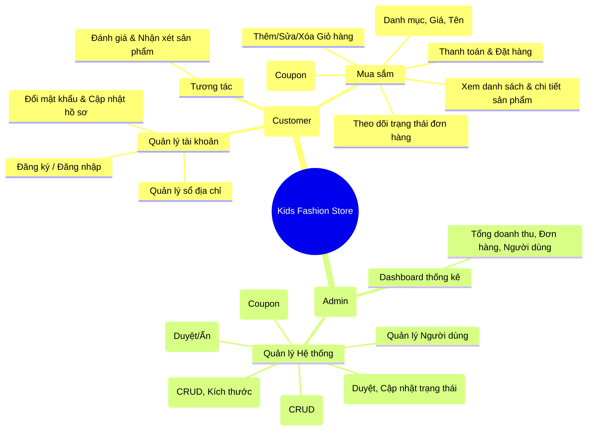
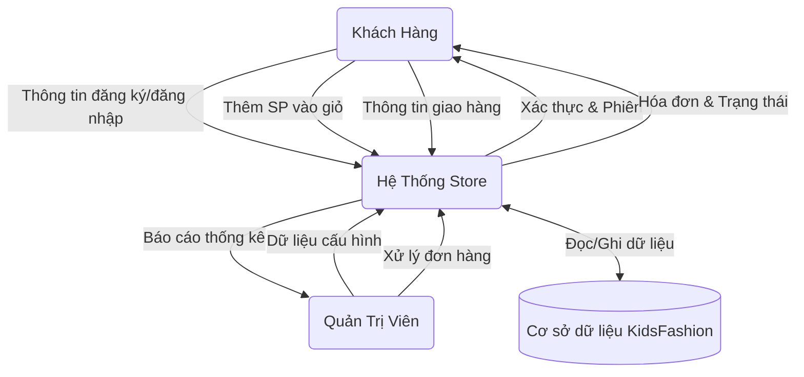
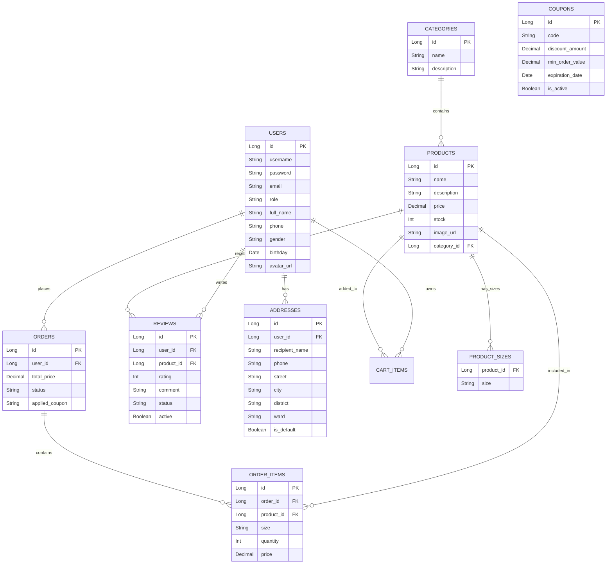

# BÁO CÁO DỰ ÁN CUỐI KỲ - KIDS FASHION STORE

## CHƯƠNG 1: MỞ ĐẦU

### 1.1 Giới thiệu đề tài
Website thương mại điện tử chuyên cung cấp quần áo trẻ em (Kids Fashion Store) được xây dựng nhằm mục đích đáp ứng nhu cầu mua sắm trực tuyến của các bậc phụ huynh. Hệ thống được phát triển trên nền tảng Java Spring Boot, cho phép quản lý toàn diện quy trình giao dịch, từ xem mặt hàng, quản lý giỏ hàng đến quản lý kho và đơn hàng phía Admin.

### 1.2 Đối tượng, phạm vi nghiên cứu
- **Đối tượng nghiên cứu:** Các quy trình nghiệp vụ mua bán hàng hóa trực tuyến, sơ đồ thiết kế hệ thống, cơ sở dữ liệu quan hệ, và lập trình phát triển ứng dụng web.
- **Phạm vi nghiên cứu:** Hệ thống ứng dụng web chuyên về thời trang với chức năng dành cho hai nhóm đối tượng chính: Khách hàng (Customer) và Quản trị viên (Admin). Giới hạn ở việc tích hợp giỏ hàng, đặt hàng, quản lý sản phẩm và lưu trữ trên Database MySQL.

### 1.3 Phương pháp nghiên cứu
- **Phương pháp thu thập thông tin và điều tra thực tiễn:** Tìm hiểu nhu cầu mua sắm quần áo trực tuyến của phụ huynh và trải nghiệm mua sắm trên các trang TMĐT thời trang để tìm ra điểm mạnh, yếu.
- **Phương pháp phân tích số liệu và so sánh:** Phân tích, so sánh các giải pháp framework và giao diện để đưa ra kỹ thuật tối ưu hóa UI/UX cho người dùng.
- **Phương pháp thiết kế kiến trúc phần mềm:** Sử dụng sơ đồ UML, biểu diễn lược đồ quan hệ thực thể (ERD) để phác thảo các module phần mềm rõ ràng.

### 1.4 Kết cấu của báo cáo thực tập
Báo cáo gồm 5 chương chính tiêu biểu:
- **Chương 1:** Mở đầu.
- **Chương 2:** Tìm hiểu tổng quát về khoa.
- **Chương 3:** Thực trạng chủ đề đang làm.
- **Chương 4:** Kết quả thực tập (Phân tích, thiết kế UML, xây dựng tính năng).
- **Chương 5:** Kết luận và đề xuất.

## CHƯƠNG 2: TÌM HIỂU TỔNG QUÁT VỀ KHOA
*(Ghi chú thông tin mẫu: Có thể thay thế bằng dữ liệu thực tế của đơn vị đào tạo tương ứng)*

### 2.1 Giới thiệu quá trình hình thành và phát triển đơn vị
Khoa Công nghệ Thông tin là một trong những đơn vị đào tạo mũi nhọn, có bề dày lịch sử trong việc cung cấp đội ngũ cử nhân/kỹ sư phần mềm vững chắc cho ngành công nghiệp phần mềm số. Với cơ sở phòng máy thực hành liên tục nâng cấp và chương trình tinh chỉnh qua các năm, khoa luôn mang đến môi trường giáo dục kiến tạo thiết thực nhất.

### 2.2 Nhiệm vụ, chức năng của đơn vị
- **Đào tạo nhân lực chất lượng cao:** Giảng dạy tư duy logic và kỹ năng thực chiến (Java Web, AI, Data Science...).
- **Nghiên cứu khoa học và Chuyển giao công nghệ:** Khuyến khích giảng viên và sinh viên có các đồ án ứng dụng thực tiễn đóng góp chung vào ngành GD&ĐT.
- **Trọng tâm liên kết thực tiễn:** Đồng hành cùng tổ chức/doanh nghiệp, đưa sinh viên tiếp nhận các bài toán và công nghệ chuyên nghiệp từ rất sớm.

### 2.3 Giới thiệu cơ cấu tổ chức và nhân sự của đơn vị
Bộ máy tổ chức của Khoa được chia thành ban Chủ nhiệm và các chuyên ban cốt yếu:
- Bộ môn Kỹ Thuật Phần Mềm.
- Bộ môn Khoa Học Máy Tính.
- Bộ môn Mạng máy tính và Truyền thông.
- Bộ môn Trí tuệ Nhân tạo.
Cùng với lực lượng chuyên môn dày dặn kinh nghiệm bao gồm các Thạc sĩ, Tiến sĩ đang tham gia cố vấn định hướng tận tâm cho sinh viên.

## CHƯƠNG 3: THỰC TRẠNG CHỦ ĐỀ ĐANG LÀM

### 3.1 Tìm hiểu các ứng dụng tương tự trên thị trường
Thị trường TMĐT cung cấp thời trang cho trẻ em hiện nay phong phú nhưng vẫn tồn tại phân mảnh trải nghiệm:
- **Các sàn thương mại tổng hợp (Shopee, Lazada):** Dù đa dạng hàng hóa nhưng mật độ giao diện (UI) chật chội, nhiều flash sale khiến gian hàng bị che lấp, làm mất đi tính độc quyền (Premium) của một brand thời trang trẻ em cao cấp.
- **Các Web hãng thời trang riêng lẻ (Rabity, Canifa):** Giao diện tập trung hơn và thẩm mỹ cao hơn, tuy nhiên một số trang xử lý bộ lọc (Filter) và tốc độ tải trang phản hồi giỏ hàng đôi lúc chưa mượt mà trên chuẩn màn hình Responsive.

### 3.2 Đặc tả yêu cầu bài toán
**Nhiệm vụ và chức năng hệ thống:** 
- **Đối với Khách hàng:** Nền tảng phải đáp ứng mọi truy cập mượt mà trên máy tính lẫn di động (Giao diện đáp ứng - Mobile First). Có tính năng tìm vùng mở rộng Search Bar slide-in hiện đại. Xem và lọc chi tiết áo quần chuẩn tỉ lệ ảnh thời trang. Thêm hàng vào giỏ và tương tác đánh giá sản phẩm.
- **Đối với Admin:** Xây dựng Dashboard kiểm soát tình hình kinh doanh tổng thể và quản lý chuyên sâu từ Mẫu mã, Tùy chọn Kích thước (Size), Kho hàng, đến đơn đặt hành và phân quyền Khuyến mãi.

**Phạm vi hệ thống:** 
Hoàn thiện toàn vẹn hệ sinh thái quản lý mua bán và tồn kho mặt hàng bằng hệ thống Web App dựa trên framework Spring Boot kết nối MySQL, xử lý giao tiếp frontend tĩnh qua Thymeleaf.

## CHƯƠNG 4: KẾT QUẢ THỰC TẬP
## 4.1. Sơ đồ hệ thống

### A. Sơ đồ phân cấp chức năng

### B. Sơ đồ luồng dữ liệu (Data Flow Diagram - DFD)

### C. Sơ đồ quan hệ dữ liệu (ERD)

## 4.2. Xây dựng chương trình

### a. Các chức năng đã xây dựng được
1. **Quản lý Tài khoản (Authentication & Profile):** 
   - Đăng nhập, đăng ký, mã hóa mật khẩu bảo mật (Spring Security & BCrypt).
   - Quản lý thông tin cá nhân (Profile) và quản lý danh sách địa chỉ giao hàng.
2. **Mua sắm (Shopping):**
   - Xem danh sách sản phẩm, lọc theo danh mục, sắp xếp đa dạng.
   - Thanh tìm kiếm động (Expandable Search Bar) hiện đại, thích ứng đa màn hình Responsive.
   - Xem chi tiết sản phẩm, chọn size phù hợp.
3. **Giỏ hàng & Đặt hàng (Cart & Order):**
   - Thêm vào giỏ hàng với thông tin Size và Số lượng.
   - Quản lý giỏ hàng: Cập nhật số lượng, Lọc theo Session, Xóa sản phẩm.
   - Áp dụng mã giảm giá (Coupon/Voucher code).
   - Đặt hàng và tính tổng tiền tự động. Lịch sử theo dõi trạng thái đơn hàng khách hàng (Pending, Processing, Shipped, v.v.).
4. **Đánh giá Sản phẩm (Review System):**
   - Xem nhận xét và số sao trung bình trên từng chi tiết sản phẩm.
   - Để lại đánh giá sản phẩm dành cho khách đã mua hàng/đăng nhập.
5. **Trang Quản trị (Admin Dashboard):**
   - Tổng quan thống kê doanh thu, số lượng đơn hàng, người tiêu dùng.
   - Vận hành Hệ thống: Quản lý Sản phẩm, Danh mục, Đơn hàng, Người dùng, Đánh giá, Khuyến mãi (CRUD) hoàn chỉnh với giao diện tiện dụng.

### b. Các chức năng trong dự kiến nhưng chưa xây dựng được
- Tích hợp cổng thanh toán trực tuyến (VNPAY, MoMo, ZaloPay) thay vì mới chỉ xây dựng tính năng thanh toán COD.
- Tính năng gửi Email thông báo tự động hóa (Nhắc nhở, Hóa đơn điện tử, Chăm sóc khách hàng).
- Hệ thống Gợi ý Sản phẩm thông minh (AI Recommendations) dựa trên hành vi mua sắm.
- Tích hợp Chat trực tuyến (Live Chat) để tư vấn trực tiếp ngoài hệ thống website.

### c. Link demo
- Môi trường Local: `http://localhost:8080/` (Dùng Spring Boot Embedded Tomcat Server).
- Cơ sở dữ liệu: Chạy trên MySQL localhost:3306 với Data Schema tạo tự động bằng JPA/Hibernate.

---

## 4.3. Tạo lập bảng CSDL

Toàn bộ CSDL được ánh xạ tự động từ mã nguồn Java (Hibernate/JPA). Danh sách 10 bảng (Tables) chính yếu:
1. **`users`**: Lưu trữ thông tin tài khoản (id, username, password, email, role, profile_info, created_at, updated_at).
2. **`addresses`**: Lưu sổ địa chỉ của khách hàng sử dụng để giao nhận (id, user_id, street, ward, district, city, default_status).
3. **`categories`**: Lưu hạng mục phân loại sản phẩm (Quần, Áo, Váy...).
4. **`products`**: Quản lý thông tin sản phẩm (id, name, price, stock, image_url, category_id, timestamps).
5. **`product_sizes`**: Lưu các size hiện vật của từng mặt hàng (product_id, size - dùng `@CollectionTable`).
6. **`cart_items`**: Lưu trạng thái giỏ hàng trước thanh toán của khách hàng.
7. **`orders`**: Ghi lại thông tin hóa đơn khi khách nhấn Đặt Hàng (id, user_id, total_price, status, applied_coupon).
8. **`order_items`**: Ghi rõ chi tiết từng loại áo quần/size số mà đơn hàng đó bao gồm. Liên kết phụ thuộc chặt chẽ với bảng `orders`.
9. **`reviews`**: Quản lý hệ thống điểm, số sao từ người dùng (user_id, product_id, rating, comment, active_status).
10. **`coupons`**: Cơ sở dữ liệu chứa các mã ưu đãi (mã code, số tiền giảm, giá trị mua tối thiểu, hạn sử dụng).

---

## 4.4. Nhận xét, đánh giá: so sánh giữa lý thuyết và thực tiễn

- **Đứng từ hướng Lý thuyết:** Việc thiết kế ứng dụng đi qua chuẩn mô hình MVC (Model - View - Controller), theo nguyên tắc SOLID thường cho chúng ta cảm giác mọi dữ liệu, giao diện phân tách vô cùng rành mạch. Việc áp thẻ CSDL luôn được giả định là lý tưởng như trên sơ đồ ERD.
- **Tiếp xúc vào Thực tiễn:** 
  - Trong quá trình triển khai code (Code implementation) bằng Framework Spring Boot và Thymeleaf, việc truyền dữ liệu qua lại (Data Binding), cũng như duy trì State (Cart, Session của Khách vô danh) là những thách thức không nhỏ. Việc này bắt buộc dùng phối hợp linh động phương thức AJAX và Session Cookies.
  - Về phương thức hiển thị UI/UX frontend: Áp dụng CSS Responsive theo lý thuyết chỉ dựa vào các vạch Media Query đơn thuần là không đủ. Thực tế phải giải quyết các bài toán vi mô như tỷ lệ khung hình chuẩn của thời trang (Dùng `aspect-ratio: 3/4`, `object-fit: cover`) hay hiệu ứng Expandable Search Bar để hệ thống không bị lỗi vỡ khung, đè lệch các thành phần chữ Menu (Fix bằng `white-space: nowrap`, `flex-shrink`).
  - Về dữ liệu cơ sở CSDL: JPA xử lý Object mapping rất tốt, nhưng đôi lúc vẫn xảy ra vấn đề LazyInitializationException nếu truy xuất dữ liệu con mà Session đã đóng, buộc phải linh động fetch các Collection cẩn thận.

---

## 4.5. Những khó khăn trong quá trình thực hiện

1. **Hiển thị giao diện & Trải nghiệm người dùng:** Rất cực nhọc trong công cuộc căn chỉnh tỉ lệ hình ảnh phù hợp với Form mẫu ngành hàng thời trang, và đảm bảo navbar Header được mượt mà trên Mobile/Tablet. Các tương tác vi mô (micro-interactions) như phóng to ảnh lúc hover hay xử lý Navbar Overlap tốn nhiều công sức để trau chuốt.
2. **Tích hợp Spring Security & AJAX Flow:** Áp dụng phân quyền chặt chẽ giữa `ADMIN` và `USER`. Không ít lần gặp khó khăn liên đới tới bảo mật token bảo vệ Form (CSRF Token validation failed) khi gửi JSON Payload thông qua AJAX bên trong Modal Đăng nhập hoặc Giỏ hàng.
3. **Giao diện Dashboard Quản trị (Admin):** Việc chỉnh sửa và tái định cấu hình bố cục của Theme AdminLTE/Bootstrap để tạo ra một không gian quản lý sạch sẽ, mạch lạc với mã màu cá nhân hóa yêu cầu am hiểu sâu sắc về CSS tính thừa kế và sử dụng `!important` đúng chỗ.
4. **Logic luồng nghiệp vụ kinh doanh:** Xử lý rẽ nhánh hệ thống khi áp dụng mã Giảm Giá (Coupon) – Phải lưu lại trạng thái mã trong Session, tính toán trừ tiền trên Layout và xử lý chặt ràng buộc điều kiện (vd đơn hàng tối thiểu). Xử lý tồn kho (Stock) hay Mảng dữ liệu Size áo linh động (`Set<SizeEnum>`) cho sản phẩm đòi hỏi các câu lệnh truy vấn phức tạp.

## CHƯƠNG 5: KẾT LUẬN VÀ ĐỀ XUẤT

### 5.1 Tóm tắt kết quả
**Những ưu điểm nổi bật:**
- Đã hoàn thiện một ứng dụng Website E-Commerce với vòng lặp quy trình logic chặt chẽ (Từ Đăng ký tài khoản -> Duyệt hàng -> Giỏ hàng bằng Session/User -> Thanh toán & Lưu sổ đơn hàng).
- Trọng tâm giao diện UI/UX được đẩy lên mức chuyên nghiệp, xử lý CSS Responsive tỉ mỉ ở các chi tiết như: Thanh tìm kiếm động trượt ẩn/hiện, tỉ lệ hiển thị ảnh thời trang chuẩn 3/4 giúp hình ảnh không bị cắt xén, các Micro-animations cho nút tương tác.
- Lợi dụng tốt sức mạnh của quy chuẩn MVC, tách biệt mã HTML Thymeleaf cùng với xử lý API qua Spring Security Authentication bảo vệ thông tin hoàn hảo.

**Khuyết điểm còn tồn đọng:**
- Ở phiên bản hiện tại, dự án mới chỉ chấp nhận trả tiền mặt khi nhận hàng (COD), chưa tích hợp thực tế việc gọi API từ ví điện tử VNPAY hay MoMo, ZaloPay.
- Chưa ứng dụng dịch vụ gửi Email thông báo hóa đơn tự động bằng SMTP tới hộp thư phía khách mua hàng mỗi khi đơn hàng được đặt/giao.

### 5.2 Các bài học rút ra từ kết quả của đợt thực hiện
- **Về Tư duy Phân tích Dữ liệu (Modeling):** Bài học sâu sắc qua việc thiết kế lược đồ quan hệ ORM bằng JPA, ứng dụng mapping qua lại khéo léo giữa `@OneToMany` và `@ManyToOne` với các bảng Danh mục - Sản phẩm - Giỏ Hàng - Đơn hàng sao cho chuẩn Hibernate và ngăn ngừa N+1 Query.
- **Về Lập trình Nghiệp vụ:** Nắm vững được khả năng tổ chức logic phần mềm, xử lý linh động qua công nghệ AJAX để vận dụng tối đa tiện ích (như Thêm/Xóa sản phẩm ở cửa sổ Cart Modal mà không dùng Refresh Page ảnh hưởng mạch xem hàng).
- **Về Nghệ thuật Xây dựng UI/UX:** Học hỏi vô vàn kinh nghiệm qua việc sửa chữa các bug CSS vỡ layout trên đa thiết bị. Khắc sâu kỹ thuật điều chế Media Query và Flexbox / Grid để đem lại giá trị thẩm mỹ cho ứng dụng tương tác của khách hàng thực tế ngày nay.
