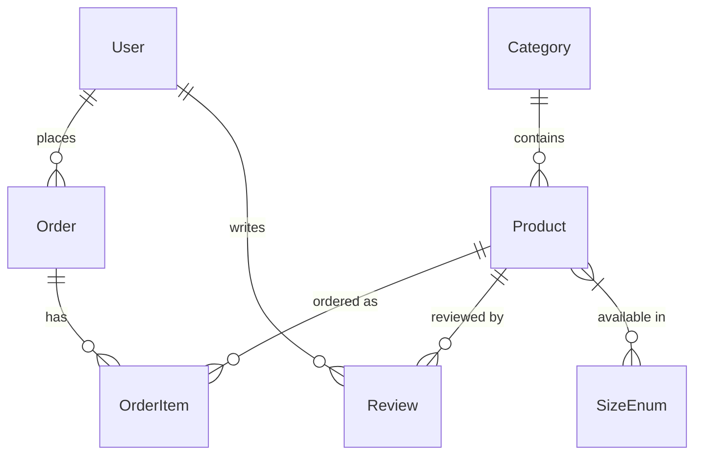

# 📋 Phân Tích Toàn Bộ Codebase — Kids Fashion Store

## 1. Tổng Quan Dự Án

**Kids Fashion Store** là một ứng dụng **E-commerce bán quần áo thời trang trẻ em**, xây dựng theo kiến trúc **MVC monolith** trên nền tảng:

| Thành phần | Công nghệ |
|---|---|
| Framework | **Spring Boot 3.5.11** (Java 17) |
| Template Engine | **Thymeleaf** + `thymeleaf-extras-springsecurity6` |
| ORM | **Spring Data JPA** + Hibernate |
| Database | **MySQL** (`localhost:3306/kidsfashion`) |
| Security | **Spring Security** (BCrypt, form-login, CSRF) |
| CSS Framework | **Bootstrap 5.3** + **AdminLTE 3.2** (trang admin) |
| JS Libraries | jQuery 3.6, Chart.js, Font Awesome 6.4 |
| Build | **Maven** ([mvnw](file:///Users/leduykhang/Downloads/L%E1%BA%ADp%20Tr%C3%ACnh%20Java%20N%C3%A2ng%20Cao/kids-fashion-store/mvnw)) |
| Utilities | **Lombok**, **ModelMapper** 3.2 |

---

## 2. Kiến Trúc & Cấu Trúc Thư Mục

```
src/main/java/com/example/kidsfashion/
├── KidsFashionApplication.java          ← Entry point
├── config/
│   ├── AppConfig.java                   ← Bean ModelMapper
│   ├── SecurityConfig.java              ← Security rules, BCrypt, CSRF
│   └── WebConfig.java                   ← Static resources & upload path
├── entity/                              ← 9 entity/enum classes
├── dto/                                 ← 7 DTO classes
├── repository/                          ← 6 JPA repositories
├── service/                             ← 7 service classes
├── controller/                          ← 10 controller classes
└── exception/
    └── GlobalExceptionHandler.java      ← Catch-all → redirect "/"

src/main/resources/
├── application.properties               ← Cấu hình toàn bộ
├── static/
│   ├── css/style.css                    ← 1111 dòng CSS custom
│   └── js/main.js                       ← 471 dòng JavaScript
└── templates/                           ← 24 file Thymeleaf HTML
```

---

## 3. Phân Tích Chi Tiết Từng Layer

### 3.1 Entity Layer (9 files)

| Entity | Bảng DB | Vai trò | Quan hệ chính |
|---|---|---|---|
| [User](file:///Users/leduykhang/Downloads/L%E1%BA%ADp%20Tr%C3%ACnh%20Java%20N%C3%A2ng%20Cao/kids-fashion-store/src/main/java/com/example/kidsfashion/entity/User.java) | `users` | Người dùng (admin/customer) | `role` = `ROLE_ADMIN` hoặc `ROLE_CUSTOMER` |
| [Product](file:///Users/leduykhang/Downloads/L%E1%BA%ADp%20Tr%C3%ACnh%20Java%20N%C3%A2ng%20Cao/kids-fashion-store/src/main/java/com/example/kidsfashion/entity/Product.java) | `products` | Sản phẩm | ManyToOne → Category, OneToMany → OrderItem, ElementCollection → sizes |
| [Category](file:///Users/leduykhang/Downloads/L%E1%BA%ADp%20Tr%C3%ACnh%20Java%20N%C3%A2ng%20Cao/kids-fashion-store/src/main/java/com/example/kidsfashion/entity/Category.java) | `categories` | Danh mục | OneToMany → Product (cascade ALL) |
| [Order](file:///Users/leduykhang/Downloads/L%E1%BA%ADp%20Tr%C3%ACnh%20Java%20N%C3%A2ng%20Cao/kids-fashion-store/src/main/java/com/example/kidsfashion/entity/Order.java) | `orders` | Đơn hàng | ManyToOne → User, OneToMany → OrderItem |
| [OrderItem](file:///Users/leduykhang/Downloads/L%E1%BA%ADp%20Tr%C3%ACnh%20Java%20N%C3%A2ng%20Cao/kids-fashion-store/src/main/java/com/example/kidsfashion/entity/OrderItem.java) | `order_items` | Chi tiết đơn hàng | ManyToOne → Order, Product; lưu `size`, `price` tại thời điểm đặt |
| [CartItem](file:///Users/leduykhang/Downloads/L%E1%BA%ADp%20Tr%C3%ACnh%20Java%20N%C3%A2ng%20Cao/kids-fashion-store/src/main/java/com/example/kidsfashion/entity/CartItem.java) | *(session-based)* | Giỏ hàng | Lưu trong `HttpSession`, không có `@Entity` |
| [Review](file:///Users/leduykhang/Downloads/L%E1%BA%ADp%20Tr%C3%ACnh%20Java%20N%C3%A2ng%20Cao/kids-fashion-store/src/main/java/com/example/kidsfashion/entity/Review.java) | `reviews` | Đánh giá sản phẩm | ManyToOne → User, Product; Unique(user, product); auto-approved |
| [Coupon](file:///Users/leduykhang/Downloads/L%E1%BA%ADp%20Tr%C3%ACnh%20Java%20N%C3%A2ng%20Cao/kids-fashion-store/src/main/java/com/example/kidsfashion/entity/Coupon.java) | `coupons` | Mã giảm giá | `discountPercent`, `startDate`, `endDate` |
| [SizeEnum](file:///Users/leduykhang/Downloads/L%E1%BA%ADp%20Tr%C3%ACnh%20Java%20N%C3%A2ng%20Cao/kids-fashion-store/src/main/java/com/example/kidsfashion/entity/SizeEnum.java) / [ReviewStatus](file:///Users/leduykhang/Downloads/L%E1%BA%ADp%20Tr%C3%ACnh%20Java%20N%C3%A2ng%20Cao/kids-fashion-store/src/main/java/com/example/kidsfashion/entity/ReviewStatus.java) | — | Enum | `S, M, L, XL` / `PENDING, APPROVED, REJECTED` |



### 3.2 Repository Layer (6 files)

| Repository | Custom Queries |
|---|---|
| [ProductRepository](file:///Users/leduykhang/Downloads/L%E1%BA%ADp%20Tr%C3%ACnh%20Java%20N%C3%A2ng%20Cao/kids-fashion-store/src/main/java/com/example/kidsfashion/repository/ProductRepository.java#14-36) | [search()](file:///Users/leduykhang/Downloads/L%E1%BA%ADp%20Tr%C3%ACnh%20Java%20N%C3%A2ng%20Cao/kids-fashion-store/src/main/java/com/example/kidsfashion/repository/ProductRepository.java#19-21) bằng LIKE, [findLatestProducts()](file:///Users/leduykhang/Downloads/L%E1%BA%ADp%20Tr%C3%ACnh%20Java%20N%C3%A2ng%20Cao/kids-fashion-store/src/main/java/com/example/kidsfashion/repository/ProductRepository.java#22-24), [findBestSellingProducts()](file:///Users/leduykhang/Downloads/L%E1%BA%ADp%20Tr%C3%ACnh%20Java%20N%C3%A2ng%20Cao/kids-fashion-store/src/main/java/com/example/kidsfashion/repository/ProductRepository.java#25-27) (ORDER BY SIZE orderItems), [findTopSellingProductsWithCount()](file:///Users/leduykhang/Downloads/L%E1%BA%ADp%20Tr%C3%ACnh%20Java%20N%C3%A2ng%20Cao/kids-fashion-store/src/main/java/com/example/kidsfashion/repository/ProductRepository.java#28-35) (SUM quantity) |
| [OrderRepository](file:///Users/leduykhang/Downloads/L%E1%BA%ADp%20Tr%C3%ACnh%20Java%20N%C3%A2ng%20Cao/kids-fashion-store/src/main/java/com/example/kidsfashion/repository/OrderRepository.java#14-30) | [findByUser()](file:///Users/leduykhang/Downloads/L%E1%BA%ADp%20Tr%C3%ACnh%20Java%20N%C3%A2ng%20Cao/kids-fashion-store/src/main/java/com/example/kidsfashion/repository/OrderRepository.java#17-18), [findLatestOrders()](file:///Users/leduykhang/Downloads/L%E1%BA%ADp%20Tr%C3%ACnh%20Java%20N%C3%A2ng%20Cao/kids-fashion-store/src/main/java/com/example/kidsfashion/repository/OrderRepository.java#19-21), [getTotalRevenue()](file:///Users/leduykhang/Downloads/L%E1%BA%ADp%20Tr%C3%ACnh%20Java%20N%C3%A2ng%20Cao/kids-fashion-store/src/main/java/com/example/kidsfashion/service/OrderService.java#130-135) (SUM DELIVERED), [existsByUserIdAndProductIdAndStatus()](file:///Users/leduykhang/Downloads/L%E1%BA%ADp%20Tr%C3%ACnh%20Java%20N%C3%A2ng%20Cao/kids-fashion-store/src/main/java/com/example/kidsfashion/repository/OrderRepository.java#25-29) |
| [ReviewRepository](file:///Users/leduykhang/Downloads/L%E1%BA%ADp%20Tr%C3%ACnh%20Java%20N%C3%A2ng%20Cao/kids-fashion-store/src/main/java/com/example/kidsfashion/repository/ReviewRepository.java#15-39) | [findByProductAndStatus()](file:///Users/leduykhang/Downloads/L%E1%BA%ADp%20Tr%C3%ACnh%20Java%20N%C3%A2ng%20Cao/kids-fashion-store/src/main/java/com/example/kidsfashion/repository/ReviewRepository.java#18-20), [getAverageRatingForProduct()](file:///Users/leduykhang/Downloads/L%E1%BA%ADp%20Tr%C3%ACnh%20Java%20N%C3%A2ng%20Cao/kids-fashion-store/src/main/java/com/example/kidsfashion/repository/ReviewRepository.java#25-28), [countApprovedByProduct()](file:///Users/leduykhang/Downloads/L%E1%BA%ADp%20Tr%C3%ACnh%20Java%20N%C3%A2ng%20Cao/kids-fashion-store/src/main/java/com/example/kidsfashion/repository/ReviewRepository.java#29-32), [findAllByOrderByCreatedAtDesc()](file:///Users/leduykhang/Downloads/L%E1%BA%ADp%20Tr%C3%ACnh%20Java%20N%C3%A2ng%20Cao/kids-fashion-store/src/main/java/com/example/kidsfashion/repository/ReviewRepository.java#33-34) |
| [CouponRepository](file:///Users/leduykhang/Downloads/L%E1%BA%ADp%20Tr%C3%ACnh%20Java%20N%C3%A2ng%20Cao/kids-fashion-store/src/main/java/com/example/kidsfashion/repository/CouponRepository.java#10-15) | [findByCodeAndStartDateLessThanEqualAndEndDateGreaterThanEqual()](file:///Users/leduykhang/Downloads/L%E1%BA%ADp%20Tr%C3%ACnh%20Java%20N%C3%A2ng%20Cao/kids-fashion-store/src/main/java/com/example/kidsfashion/repository/CouponRepository.java#13-14) — tìm coupon hợp lệ theo ngày |
| [UserRepository](file:///Users/leduykhang/Downloads/L%E1%BA%ADp%20Tr%C3%ACnh%20Java%20N%C3%A2ng%20Cao/kids-fashion-store/src/main/java/com/example/kidsfashion/repository/UserRepository.java#9-13) | [findByUsername()](file:///Users/leduykhang/Downloads/L%E1%BA%ADp%20Tr%C3%ACnh%20Java%20N%C3%A2ng%20Cao/kids-fashion-store/src/main/java/com/example/kidsfashion/repository/UserRepository.java#11-12) |
| [CategoryRepository](file:///Users/leduykhang/Downloads/L%E1%BA%ADp%20Tr%C3%ACnh%20Java%20N%C3%A2ng%20Cao/kids-fashion-store/src/main/java/com/example/kidsfashion/repository/CategoryRepository.java#7-10) | Chỉ dùng method mặc định JpaRepository |

### 3.3 Service Layer (7 files)

| Service | Chức năng chính | Điểm đáng chú ý |
|---|---|---|
| [UserService](file:///Users/leduykhang/Downloads/L%E1%BA%ADp%20Tr%C3%ACnh%20Java%20N%C3%A2ng%20Cao/kids-fashion-store/src/main/java/com/example/kidsfashion/service/UserService.java) | CRUD user + `UserDetailsService` | [createUser()](file:///Users/leduykhang/Downloads/L%E1%BA%ADp%20Tr%C3%ACnh%20Java%20N%C3%A2ng%20Cao/kids-fashion-store/src/main/java/com/example/kidsfashion/service/UserService.java#43-49) mã hóa BCrypt, [updateUser()](file:///Users/leduykhang/Downloads/L%E1%BA%ADp%20Tr%C3%ACnh%20Java%20N%C3%A2ng%20Cao/kids-fashion-store/src/main/java/com/example/kidsfashion/service/UserService.java#50-55) giữ nguyên hash |
| [ProductService](file:///Users/leduykhang/Downloads/L%E1%BA%ADp%20Tr%C3%ACnh%20Java%20N%C3%A2ng%20Cao/kids-fashion-store/src/main/java/com/example/kidsfashion/service/ProductService.java) | CRUD product, upload ảnh, pagination | **MD5 checksum** để so sánh ảnh cũ/mới, tự động xóa ảnh cũ khi cập nhật |
| [CategoryService](file:///Users/leduykhang/Downloads/L%E1%BA%ADp%20Tr%C3%ACnh%20Java%20N%C3%A2ng%20Cao/kids-fashion-store/src/main/java/com/example/kidsfashion/service/CategoryService.java) | CRUD category | Dùng ModelMapper convert DTO ↔ Entity |
| [OrderService](file:///Users/leduykhang/Downloads/L%E1%BA%ADp%20Tr%C3%ACnh%20Java%20N%C3%A2ng%20Cao/kids-fashion-store/src/main/java/com/example/kidsfashion/service/OrderService.java) | Tạo đơn hàng, cập nhật status | Trừ tồn kho, áp dụng coupon, xóa giỏ hàng sau khi đặt; **monthly revenue/orders là mock data** |
| [CartService](file:///Users/leduykhang/Downloads/L%E1%BA%ADp%20Tr%C3%ACnh%20Java%20N%C3%A2ng%20Cao/kids-fashion-store/src/main/java/com/example/kidsfashion/service/CartService.java) | Quản lý giỏ hàng trong session | Hỗ trợ size cho mỗi item, kiểm tra stock, áp dụng/gỡ coupon |
| [ReviewService](file:///Users/leduykhang/Downloads/L%E1%BA%ADp%20Tr%C3%ACnh%20Java%20N%C3%A2ng%20Cao/kids-fashion-store/src/main/java/com/example/kidsfashion/service/ReviewService.java) | Thêm review, lấy reviews đã duyệt | Chỉ cho review nếu đã mua + đơn DELIVERED; auto-approve; `Hibernate.initialize()` cho lazy loading |
| [CouponService](file:///Users/leduykhang/Downloads/L%E1%BA%ADp%20Tr%C3%ACnh%20Java%20N%C3%A2ng%20Cao/kids-fashion-store/src/main/java/com/example/kidsfashion/service/CouponService.java) | CRUD coupon, áp dụng giảm giá | Xác minh thời hạn coupon theo `LocalDate.now()` |

### 3.4 Controller Layer (10 files)

| Controller | URL Pattern | Loại | Chức năng |
|---|---|---|---|
| [ProductController](file:///Users/leduykhang/Downloads/L%E1%BA%ADp%20Tr%C3%ACnh%20Java%20N%C3%A2ng%20Cao/kids-fashion-store/src/main/java/com/example/kidsfashion/controller/ProductController.java#22-115) | `/`, `/products`, `/product/{id}`, `/search` | MVC | Trang chủ, danh sách sản phẩm, chi tiết, tìm kiếm |
| [CartController](file:///Users/leduykhang/Downloads/L%E1%BA%ADp%20Tr%C3%ACnh%20Java%20N%C3%A2ng%20Cao/kids-fashion-store/src/main/java/com/example/kidsfashion/controller/CartController.java#20-300) | `/cart/**` | MVC + REST API | Giỏ hàng + AJAX endpoints (add, update, remove, coupon) |
| [OrderController](file:///Users/leduykhang/Downloads/L%E1%BA%ADp%20Tr%C3%ACnh%20Java%20N%C3%A2ng%20Cao/kids-fashion-store/src/main/java/com/example/kidsfashion/controller/OrderController.java#21-78) | `/checkout`, `/orders`, `/order/{id}` | MVC | Đặt hàng, lịch sử đơn hàng |
| [CategoryController](file:///Users/leduykhang/Downloads/L%E1%BA%ADp%20Tr%C3%ACnh%20Java%20N%C3%A2ng%20Cao/kids-fashion-store/src/main/java/com/example/kidsfashion/controller/CategoryController.java#15-41) | `/categories/**` | MVC + REST | Danh mục + API JSON |
| [ReviewController](file:///Users/leduykhang/Downloads/L%E1%BA%ADp%20Tr%C3%ACnh%20Java%20N%C3%A2ng%20Cao/kids-fashion-store/src/main/java/com/example/kidsfashion/controller/ReviewController.java#16-45) | `/product/{id}/review` | MVC (POST) | Gửi review |
| [RegisterController](file:///Users/leduykhang/Downloads/L%E1%BA%ADp%20Tr%C3%ACnh%20Java%20N%C3%A2ng%20Cao/kids-fashion-store/src/main/java/com/example/kidsfashion/controller/RegisterController.java#12-54) | `/register` | MVC | Đăng ký tài khoản |
| [LogoutController](file:///Users/leduykhang/Downloads/L%E1%BA%ADp%20Tr%C3%ACnh%20Java%20N%C3%A2ng%20Cao/kids-fashion-store/src/main/java/com/example/kidsfashion/controller/LogoutController.java#6-14) | `/logout-success` | MVC | Trang thông báo đăng xuất |
| [TestController](file:///Users/leduykhang/Downloads/L%E1%BA%ADp%20Tr%C3%ACnh%20Java%20N%C3%A2ng%20Cao/kids-fashion-store/src/main/java/com/example/kidsfashion/controller/TestController.java#6-14) | `/test` | MVC | Trang test |
| [AdminController](file:///Users/leduykhang/Downloads/L%E1%BA%ADp%20Tr%C3%ACnh%20Java%20N%C3%A2ng%20Cao/kids-fashion-store/src/main/java/com/example/kidsfashion/controller/AdminController.java#23-355) | `/admin/**` | MVC | Quản lý Product, Category, Order, Coupon, User (CRUD đầy đủ) |
| [AdminReviewController](file:///Users/leduykhang/Downloads/L%E1%BA%ADp%20Tr%C3%ACnh%20Java%20N%C3%A2ng%20Cao/kids-fashion-store/src/main/java/com/example/kidsfashion/controller/AdminReviewController.java#14-74) | `/admin/reviews/**` | MVC | Quản lý review (approve/reject/delete) |

### 3.5 Security Configuration

- **Authentication**: Form-based login (modal AJAX trên frontend, redirect trên failure)
- **Password**: BCrypt encoding
- **Authorization**:
  - Public: `/`, `/products/**`, `/register`, `/css/**`, `/js/**`, `/uploads/**`, cart API endpoints
  - Authenticated: `/cart` (view), `/checkout/**`, `/orders`
  - Admin only: `/admin/**`
- **CSRF**: Bật mặc định, tắt cho 5 cart API endpoints
- **Logout**: Redirect → `/logout-success`, xóa session + cookies

### 3.6 DTO Layer (7 files)

[ProductDTO](file:///Users/leduykhang/Downloads/L%E1%BA%ADp%20Tr%C3%ACnh%20Java%20N%C3%A2ng%20Cao/kids-fashion-store/src/main/java/com/example/kidsfashion/dto/ProductDTO.java#11-29), [OrderDTO](file:///Users/leduykhang/Downloads/L%E1%BA%ADp%20Tr%C3%ACnh%20Java%20N%C3%A2ng%20Cao/kids-fashion-store/src/main/java/com/example/kidsfashion/dto/OrderDTO.java#15-29), [OrderItemDTO](file:///Users/leduykhang/Downloads/L%E1%BA%ADp%20Tr%C3%ACnh%20Java%20N%C3%A2ng%20Cao/kids-fashion-store/src/main/java/com/example/kidsfashion/dto/OrderItemDTO.java#13-24), [CategoryDTO](file:///Users/leduykhang/Downloads/L%E1%BA%ADp%20Tr%C3%ACnh%20Java%20N%C3%A2ng%20Cao/kids-fashion-store/src/main/java/com/example/kidsfashion/dto/CategoryDTO.java#11-20), [CouponDTO](file:///Users/leduykhang/Downloads/L%E1%BA%ADp%20Tr%C3%ACnh%20Java%20N%C3%A2ng%20Cao/kids-fashion-store/src/main/java/com/example/kidsfashion/dto/CouponDTO.java#14-25), [ReviewDTO](file:///Users/leduykhang/Downloads/L%E1%BA%ADp%20Tr%C3%ACnh%20Java%20N%C3%A2ng%20Cao/kids-fashion-store/src/main/java/com/example/kidsfashion/dto/ReviewDTO.java#10-25), [ProductSalesDTO](file:///Users/leduykhang/Downloads/L%E1%BA%ADp%20Tr%C3%ACnh%20Java%20N%C3%A2ng%20Cao/kids-fashion-store/src/main/java/com/example/kidsfashion/dto/ProductSalesDTO.java#6-14) — tất cả dùng Lombok `@Getter/@Setter` để transfer dữ liệu giữa service ↔ controller ↔ view.

---

## 4. Frontend Analysis

### 4.1 Layout System ([layout.html](file:///Users/leduykhang/Downloads/L%E1%BA%ADp%20Tr%C3%ACnh%20Java%20N%C3%A2ng%20Cao/kids-fashion-store/src/main/resources/templates/layout.html) — 886 dòng)

File layout **dùng chung cho cả frontend và admin**, phân biệt bằng tên view:

- **Frontend**: Navbar (Home, Products, Categories dropdown, Search, Cart, Login modal, User dropdown) → Content → Footer
- **Admin**: AdminLTE sidebar (Dashboard, Products, Categories, Orders, Coupons, Users, Reviews) → Content wrapper → Footer
- **Login Modal**: AJAX-based, hiển thị lỗi trực tiếp trong modal, tự mở sau khi register thành công

### 4.2 CSS ([style.css](file:///Users/leduykhang/Downloads/L%E1%BA%ADp%20Tr%C3%ACnh%20Java%20N%C3%A2ng%20Cao/kids-fashion-store/src/main/resources/static/css/style.css) — 1111 dòng)

- **Design system** với CSS variables: pastel tones (tím `#6366f1`, xanh ngọc `#2dd4bf`, vàng `#fbbf24`)
- **Gradients** cho buttons, cards, hero, badges, pagination
- **Animations**: hover effects, scroll-based fade-in, floating shapes trong hero
- **Responsive**: Có media queries cho mobile
- **Typography**: Google Fonts (Poppins, Inter)

### 4.3 JavaScript ([main.js](file:///Users/leduykhang/Downloads/L%E1%BA%ADp%20Tr%C3%ACnh%20Java%20N%C3%A2ng%20Cao/kids-fashion-store/src/main/resources/static/js/main.js) — 471 dòng)

Các module chính:
- `CsrfHandler`: Lấy CSRF token từ meta tags
- [fetchWithCsrf()](file:///Users/leduykhang/Downloads/L%E1%BA%ADp%20Tr%C3%ACnh%20Java%20N%C3%A2ng%20Cao/kids-fashion-store/src/main/resources/templates/cart.html#90-122): Wrapper cho fetch API với CSRF
- `Notification`: Toast notifications (Bootstrap)
- `CartManager`: Add to cart (AJAX), update cart count badge
- `CategoryManager`: Load categories dropdown qua API
- `SearchHandler`: Validate search form
- `ScrollAnimation`: IntersectionObserver fade-in
- `PriceFormatter`: Intl.NumberFormat USD

### 4.4 Thymeleaf Templates (24 files)

| Template | Mô tả |
|---|---|
| [index.html](file:///Users/leduykhang/Downloads/L%E1%BA%ADp%20Tr%C3%ACnh%20Java%20N%C3%A2ng%20Cao/kids-fashion-store/src/main/resources/templates/index.html) | Trang chủ: Hero, Categories, Latest Arrivals, Best Sellers |
| [product-list.html](file:///Users/leduykhang/Downloads/L%E1%BA%ADp%20Tr%C3%ACnh%20Java%20N%C3%A2ng%20Cao/kids-fashion-store/src/main/resources/templates/product-list.html) | Danh sách sản phẩm: pagination, sort, filter |
| [product-detail.html](file:///Users/leduykhang/Downloads/L%E1%BA%ADp%20Tr%C3%ACnh%20Java%20N%C3%A2ng%20Cao/kids-fashion-store/src/main/resources/templates/product-detail.html) | Chi tiết: ảnh, info, size selector, add to cart, reviews |
| [cart.html](file:///Users/leduykhang/Downloads/L%E1%BA%ADp%20Tr%C3%ACnh%20Java%20N%C3%A2ng%20Cao/kids-fashion-store/src/main/resources/templates/cart.html) | Giỏ hàng: bảng items, update quantity, coupon, checkout |
| [checkout.html](file:///Users/leduykhang/Downloads/L%E1%BA%ADp%20Tr%C3%ACnh%20Java%20N%C3%A2ng%20Cao/kids-fashion-store/src/main/resources/templates/checkout.html) | Xác nhận đơn hàng |
| [orders.html](file:///Users/leduykhang/Downloads/L%E1%BA%ADp%20Tr%C3%ACnh%20Java%20N%C3%A2ng%20Cao/kids-fashion-store/src/main/resources/templates/orders.html) | Lịch sử đơn hàng |
| [order-detail.html](file:///Users/leduykhang/Downloads/L%E1%BA%ADp%20Tr%C3%ACnh%20Java%20N%C3%A2ng%20Cao/kids-fashion-store/src/main/resources/templates/order-detail.html) | Chi tiết đơn hàng |
| [register.html](file:///Users/leduykhang/Downloads/L%E1%BA%ADp%20Tr%C3%ACnh%20Java%20N%C3%A2ng%20Cao/kids-fashion-store/src/main/resources/templates/register.html) | Đăng ký tài khoản |
| [logout.html](file:///Users/leduykhang/Downloads/L%E1%BA%ADp%20Tr%C3%ACnh%20Java%20N%C3%A2ng%20Cao/kids-fashion-store/src/main/resources/templates/logout.html) | Trang thông báo đăng xuất |
| [admin-dashboard.html](file:///Users/leduykhang/Downloads/L%E1%BA%ADp%20Tr%C3%ACnh%20Java%20N%C3%A2ng%20Cao/kids-fashion-store/src/main/resources/templates/admin-dashboard.html) | Dashboard: stats cards, top sellers, latest orders, Chart.js charts |
| [admin-products.html](file:///Users/leduykhang/Downloads/L%E1%BA%ADp%20Tr%C3%ACnh%20Java%20N%C3%A2ng%20Cao/kids-fashion-store/src/main/resources/templates/admin-products.html) | Quản lý sản phẩm + pagination |
| [admin-product-form.html](file:///Users/leduykhang/Downloads/L%E1%BA%ADp%20Tr%C3%ACnh%20Java%20N%C3%A2ng%20Cao/kids-fashion-store/src/main/resources/templates/admin-product-form.html) | Form thêm/sửa sản phẩm (image upload, size checkboxes) |
| [admin-categories.html](file:///Users/leduykhang/Downloads/L%E1%BA%ADp%20Tr%C3%ACnh%20Java%20N%C3%A2ng%20Cao/kids-fashion-store/src/main/resources/templates/admin-categories.html) | Quản lý danh mục |
| [admin-category-form.html](file:///Users/leduykhang/Downloads/L%E1%BA%ADp%20Tr%C3%ACnh%20Java%20N%C3%A2ng%20Cao/kids-fashion-store/src/main/resources/templates/admin-category-form.html) | Form thêm/sửa danh mục |
| [admin-orders.html](file:///Users/leduykhang/Downloads/L%E1%BA%ADp%20Tr%C3%ACnh%20Java%20N%C3%A2ng%20Cao/kids-fashion-store/src/main/resources/templates/admin-orders.html) | Quản lý đơn hàng |
| [admin-order-detail.html](file:///Users/leduykhang/Downloads/L%E1%BA%ADp%20Tr%C3%ACnh%20Java%20N%C3%A2ng%20Cao/kids-fashion-store/src/main/resources/templates/admin-order-detail.html) | Chi tiết đơn hàng (admin) |
| [admin-coupons.html](file:///Users/leduykhang/Downloads/L%E1%BA%ADp%20Tr%C3%ACnh%20Java%20N%C3%A2ng%20Cao/kids-fashion-store/src/main/resources/templates/admin-coupons.html) | Quản lý mã giảm giá |
| [admin-coupon-form.html](file:///Users/leduykhang/Downloads/L%E1%BA%ADp%20Tr%C3%ACnh%20Java%20N%C3%A2ng%20Cao/kids-fashion-store/src/main/resources/templates/admin-coupon-form.html) | Form thêm/sửa coupon |
| [admin-users.html](file:///Users/leduykhang/Downloads/L%E1%BA%ADp%20Tr%C3%ACnh%20Java%20N%C3%A2ng%20Cao/kids-fashion-store/src/main/resources/templates/admin-users.html) | Quản lý người dùng |
| [admin-user-form.html](file:///Users/leduykhang/Downloads/L%E1%BA%ADp%20Tr%C3%ACnh%20Java%20N%C3%A2ng%20Cao/kids-fashion-store/src/main/resources/templates/admin-user-form.html) | Form thêm/sửa user (password change option) |
| [admin-reviews.html](file:///Users/leduykhang/Downloads/L%E1%BA%ADp%20Tr%C3%ACnh%20Java%20N%C3%A2ng%20Cao/kids-fashion-store/src/main/resources/templates/admin-reviews.html) | Quản lý reviews (filter by status) |
| [admin-review-detail.html](file:///Users/leduykhang/Downloads/L%E1%BA%ADp%20Tr%C3%ACnh%20Java%20N%C3%A2ng%20Cao/kids-fashion-store/src/main/resources/templates/admin-review-detail.html) | Chi tiết review |
| [test.html](file:///Users/leduykhang/Downloads/L%E1%BA%ADp%20Tr%C3%ACnh%20Java%20N%C3%A2ng%20Cao/kids-fashion-store/src/main/resources/templates/test.html) | Trang test |

---

## 5. Luồng Nghiệp Vụ Chính

### 5.1 Mua hàng
```
Xem sản phẩm → Chọn size + số lượng → Add to Cart (AJAX)
→ Xem giỏ hàng → Áp dụng Coupon (tuỳ chọn) → Checkout
→ Place Order → Trừ stock, tạo Order + OrderItems → Xoá cart session
```

### 5.2 Đánh giá sản phẩm
```
Đăng nhập → Mua hàng → Đơn hàng status = DELIVERED
→ Vào trang sản phẩm → Form review hiện lên
→ Chọn rating + comment → Submit → Auto-approved → Hiển thị ngay
```

### 5.3 Admin quản lý
```
Login (ROLE_ADMIN) → Dashboard (thống kê, biểu đồ)
→ CRUD: Products, Categories, Orders (update status), Coupons, Users, Reviews
```

---

## 6. Nhận Xét & Đánh Giá

### ✅ Điểm mạnh

1. **Kiến trúc rõ ràng**: Phân tách Entity → Repository → Service → Controller → View theo đúng MVC
2. **Security đầy đủ**: BCrypt, CSRF handling (cả server-side và JS), role-based access
3. **UX tốt**: AJAX cart operations, toast notifications, modal login, scroll animations
4. **Admin panel hoàn chỉnh**: Dashboard với Chart.js, CRUD đầy đủ cho tất cả entities
5. **Image management**: MD5 checksum dedup, auto-delete old images, validation (type + size)
6. **Business logic chặt chẽ**: Stock checking, coupon date validation, purchase-gated reviews
7. **Dual layout**: Frontend và Admin dùng chung [layout.html](file:///Users/leduykhang/Downloads/L%E1%BA%ADp%20Tr%C3%ACnh%20Java%20N%C3%A2ng%20Cao/kids-fashion-store/src/main/resources/templates/layout.html) với conditional rendering thông minh

### ⚠️ Điểm cần cải thiện

1. **`System.out.println` debug logs**: Nên thay bằng `Logger` (SLF4J) xuyên suốt — nhiều service/controller đang dùng `System.out`
2. **Exception handling**: [GlobalExceptionHandler](file:///Users/leduykhang/Downloads/L%E1%BA%ADp%20Tr%C3%ACnh%20Java%20N%C3%A2ng%20Cao/kids-fashion-store/src/main/java/com/example/kidsfashion/exception/GlobalExceptionHandler.java#7-16) quá đơn giản (catch all → redirect `/`), có thể làm mất context lỗi
3. **`open-in-view=false`** nhưng [ReviewService](file:///Users/leduykhang/Downloads/L%E1%BA%ADp%20Tr%C3%ACnh%20Java%20N%C3%A2ng%20Cao/kids-fashion-store/src/main/java/com/example/kidsfashion/service/ReviewService.java#17-204) phải dùng `Hibernate.initialize()` — nên dùng `JOIN FETCH` hoặc DTO projection
4. **Cart trong session**: Không persistent — mất khi restart server hoặc hết session
5. **Monthly revenue mock data**: `OrderService.getMonthlyRevenue()` trả về data cứng, chưa query thực
6. **CSRF disabled cho cart APIs**: Có thể tạo risk nếu không có biện pháp bảo vệ khác
7. **Password logging**: [UserService](file:///Users/leduykhang/Downloads/L%E1%BA%ADp%20Tr%C3%ACnh%20Java%20N%C3%A2ng%20Cao/kids-fashion-store/src/main/java/com/example/kidsfashion/service/UserService.java#14-74) in password hash ra console (`System.out.println`) — security risk
8. **[fetchWithCsrf](file:///Users/leduykhang/Downloads/L%E1%BA%ADp%20Tr%C3%ACnh%20Java%20N%C3%A2ng%20Cao/kids-fashion-store/src/main/resources/templates/cart.html#90-122) duplicated**: Hàm này được định nghĩa cả trong [main.js](file:///Users/leduykhang/Downloads/L%E1%BA%ADp%20Tr%C3%ACnh%20Java%20N%C3%A2ng%20Cao/kids-fashion-store/src/main/resources/static/js/main.js) lẫn inline trong [cart.html](file:///Users/leduykhang/Downloads/L%E1%BA%ADp%20Tr%C3%ACnh%20Java%20N%C3%A2ng%20Cao/kids-fashion-store/src/main/resources/templates/cart.html)
9. **Delete operations dùng GET**: Các endpoint delete (`/admin/products/delete/{id}`, etc.) dùng `@GetMapping` thay vì `@DeleteMapping` hoặc `@PostMapping` — vi phạm REST convention và có thể bị khai thác qua CSRF

---

## 7. Thống Kê Code

| Loại file | Số file | Tổng dòng (ước tính) |
|---|---|---|
| Java | 45 | ~2,800 |
| HTML (Thymeleaf) | 24 | ~3,500 |
| CSS | 1 | 1,111 |
| JS | 1 | 471 |
| Properties | 1 | ~90 |
| **Tổng** | **72** | **~8,000** |
